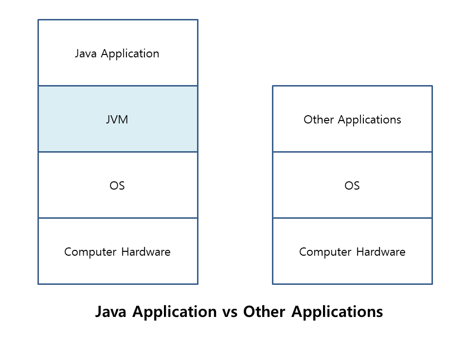
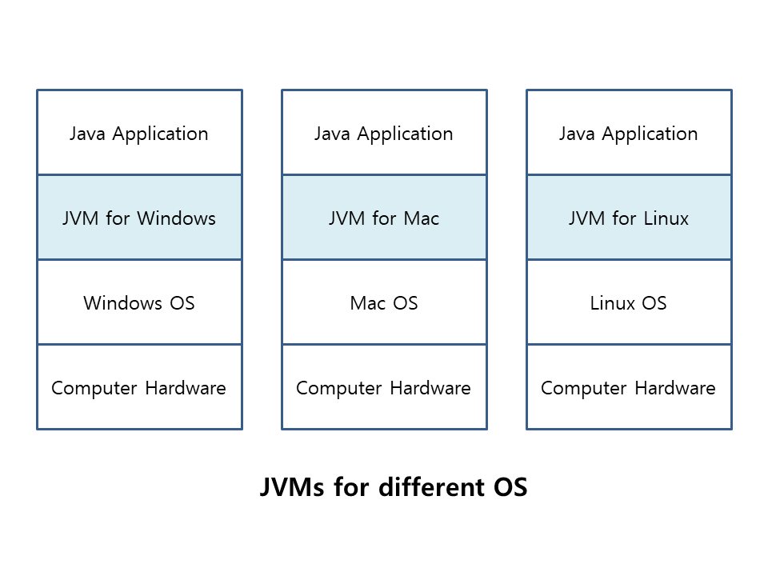

# 자바 라이브 스터디 1주차

## JVM은 무엇이며 자바 코드는 어떻게 실행하는 것인가

> 목표

```
자바 소스 파일(.java)을 JVM으로 실행하는 과정 이해하기.
```

> 학습할 것

`🟢 completed` `🟡 in progress` `⚪ not done`

- 🟢 JVM이란 무엇인가
- 🟢 컴파일 하는 방법
- 🟢 실행하는 방법
- 🟢 바이트코드란 무엇인가
- 🟢 JIT 컴파일러란 무엇이며 어떻게 동작하는지
- 🟢 JVM 구성 요소
- 🟢 JDK와 JRE의 차이

---

## JVM이란 무엇인가

JVM(Java Virtual Machine)은 '자바를 싱할하기 위한 가상기계'이다.
'가상기계'란 소프트웨어로 구현된 하드웨어를 의미하며, 실제 컴퓨터가 아닌 소프트웨어로 구현된 컴퓨터 속의 컴퓨터라고 할 수 있다.
자바로 작성된 모든 프로그램은 모두 JVM에서만 실행되기 때문에 자바 프로그램을 실행하기 위해서는 반드시 JVM이 필요하다.



위의 그림과 같이 다른 프로그램들은 OS와 바로 붙어있기 때문에 OS종속적인 반면, 자바 프로그램은 JVM과만 상호작용하기 때문에 OS와 하드웨어에 독집적이어서 다른 OS에서도 프로그램 변경없이 실행이 가능하다. 단, JVM은 OS에 종속적이기 때문에 해당 OS에서 실행가능한 JVM을 필요로 한다.



---

## 컴파일 하는 방법

프로그램을 JVM이 이해할 수 있는 형태로 변환하면 JVM이 있는 모든 컴퓨터에서 프로그램을 해석하고 실행할 수 있다. 자바 프로그램을 컴파일링 한다는 것은 프로그램파일에 있는 프로그래머가 읽을 수 있는 문서(소스코드)를 바이트코드로 변환한다는 의미이다. 바이트코드란 JVM을 위한 플랫폼 독립적인 프로그램 표현법이다.

자바 컴파일러는 유닉스와 도스쉘 OS의 커맨드라인에서 다음과 같이 호출된다:

`javac ExampleProgram.java`

참고: 자바 플랫폼 설정을 위한 구성절차의 일부는 클래스경로를 설정하는 것이다. `javac` 컴파일러 명령과 `java` 인터프리터 명령이 있는 `-classpath` 옵션을 이용하거나, `CLASSPATH` 환경변수를 설정함으로써 클래스경로를 설정할 수 있다. 컴파일러와 인터프리터 명령이 찾을 수 있도록 `ExampleProgram` class가 있는 디렉토리를 가리키도록 클래스 경로를 설정해야 한다.

---

## 실행하는 방법

프로그램이 성공적으로 자바 바이트코드로 컴파일 되었다면, 모든 JVM에서 애플리케이션을 해석하고 실행하거나 넷스케이프, IE 같은 내장 JVM으로 어떤 웹브라우저에서든 애플릿을 해석하고 실행할 수 있다. 자바 프로그램을 해석하고 실행한다는 것은 JVM 바이트코드 인터프리터를 호출한다는 의미이고, 자바 바이트코드를 플랫폼 종속적인 기계어로 변환하여 컴퓨터가 프로그램을 이해하고 실행할 수 있게 한다.

자바 인터프리터는 유닉스와 도스쉘 OS의 커맨드라인에서 다음과 같이 호출된다:

`java ExampleProgram`

---

## 바이트코드란 무엇인가

JVM를 처음 접할때 개발자들은 이를 "컴퓨터 속의 컴퓨터"라고 생각한다. 그러면 바이트코드를 "내부 컴퓨터의 CPU를 위한 기계어"나 "가공된 프로세서를 위한 기계어"로 쉽게 상상할 수 있다. 사실, 바이트코드는 실제 하드웨어 프로세서에서 실행되는 기계어와 그렇게 비슷하지 않다. 오히려 컴퓨터 과학자들은 바이트코드를 중간표현의 한 유형, 즉 소스코드와 기계어의 중간점이라고 부를 것이다. 바이트코드의 목적은 JVM의 인터프리터에 의해 효율적으로 실행될 수 있는 형식이 되는 것이다.

---

## JIT 컴파일러란 무엇이며 어떻게 동작하는지

JVM 인터프리터는 각각의 바이트코드 명령을 기계 명령 매핑에 대해 사전정의된 JVM 명령을 찾아서 해당하는 네이티브 명령으로 변환한다. 바이트코드를 직접 실행하고 어떤 최적화도 수행하지 않는다.

성능향상을 위해 JIT 컴파일러는 런타임(프로그램이 실제로 실행되는 있는 때)에 JVM와 상호작용해 적절한 바이트코드 시퀀스를 네이티브 기계어로 컴파일한다.일반적으로 JIT 컴파일러는 (인터프리터로서 한번에 하나의 문장이 아니라) 블럭 단위로 코드를 가져와서 코드를 최적화하고, 이를 최적화된 기계어로 변환한다.

JIT 컴파일러는 기본적으로 활성화 되어있는데, 비활성화 시키는 경우 전체 자바 프로그램이 해석된다. JIT 컴파일 문제를 진단하거나 해결하기 위한 경우 외에는 JIT 컴파일러를 비활성화하는 것은 권장되지 않는다.

---

## JVM 구성 요소


출처 : https://howtodoinjava.com/wp-content/uploads/2018/05/JVM-Architecture.png

### 1. Class Loader

클래스로더는 클래스파일들을 로딩하는데 사용되는 하위시스템으로, 클래스 로딩, 링킹, 초기화 등의 3가지 주요 기능을 수행한다.

#### 1.1. 클래스 로딩

클래스를 로드하기 위해 JVM은 Bootstrap, extension, application 세 가지의 클래스 로더를 가지고 있다. 클래스 파일을 로드할 때 JVM은 일부의 임의 클래스 xyz.class에 대한 종속성을 발견한다. 첫번째로 bootstrap 클래스 로더가 클래스를 찾기 위해 JRE `lib` 폴더에 있는 `rt.jar` 파일을 스캔한다. 클래스를 찾을 수 없으면 extention 클래스 로더가 **jre/lin/ext** 폴더에서 클래스 파일을 찾고 다시 찾을 수 없다면 application 클래스 로더가 시스템의 `CLASSPATH` 환경변수에 있는 모든 jar 파일과 클래스들을 찾는다. 클래스 로더에 의해 발견된 클래스는 그 클래스 로더에 의해 로드되고, 그렇지 않은 경우 `ClassNotFoundException`이 발생한다.

#### 1.2. 링킹

클래스로더에 의해 클래스가 로드 된 후 링킹이 수행된다. 바이트코드 검증기가 생성괸 바이트코드가 적절한지 검증하고, 만약 검증에 실패하면 검증오류가 발생한다. 또한 클래스에서 찾은 정적 변수와 메소드에 메모리를 할당한다.

#### 1.3. 초기화

클래스로딩의 마지막 과정으로, 여기서는 모든 정적 변수가 원래값으로 할당되고 정적 블록이 실행된다.

### 2. JVM Memory Areas 메모리 영역

JVM 내부의 메모리영역은 어플리케이션 데이터의 특정 조각들을 저장하기 위해 여러부분으로 나뉘어있다.

**메소드 영역**은 메타데이터, 상수 런타임 풀, 매소드를 위한 코드와 같은 클래스구조를 저장한다.

**힙**은 애플리케이션 실행 중에 만들어진 모든 오브젝트를 저장한다.

**스택**은 지역변수와 중간결과값을 저장한다. 이런 모든 변수는 만들어진 스레드에 대해 국부적이다. 각각의 스레드는 그 스레드가 만들어질때 동시에 만들어진 자체 JVM 스택을 가진다. 따라서 이런 모든 지역변수들을 **스레드-지역변수**라고 부른다.

**PC 레지스터**는 현재 실행중인 코드문의 물리적 메모리주소를 저장한다. 자바에서는 각각의 스레드에 별도의 PC 레지스터가 있다.

자바는 네이티브 코드 또한 사용하고 지원한다. 많은 low-level 코드들은 C나 C++와 같은 언어로 쓰여있다. 네이티브 메소드 스택은 네이티브 코드의 명령을 지킨다.

---

## JDK와 JRE의 차이

### JRE란

자바 런타임 환경(Java Runtime Environment, JRE)는 자바에서 쓰인 애플리케이션을 실행하기 위한 라이브러리(jars)와 JVM, 다른 구성요소들을 번들로 갖고 있는 소프트웨어 패키지이다. JVM은 단지 JRE의 일부이다. 자바 애플리케이션 실행을 위해서는 JRE 설치가 필요하고, 이는 어떤 컴퓨터에서든 자바를 실행하기 위한 최소한의 요구사항이다.

JRE는 JDK의 일부로 다운로드 받거나 둘을 각각 다운로드 받을 수 있다. JRE는 플랫폼 종속적으로, 컴퓨터의 유형(OS와 구조)에 따라서 JRE 번들을 선택해서 가져와 설치해야 한다. 예를 들어, 64-bit JRE 배포판을 32-bit 컴퓨터에 설치할 수 없다. 마찬가지로 윈도우용 JRE 배포판은 리눅스에서 작동하지 않고 그 반대도 마찬가지이다.

### JDK란

JDK는 JRE의 수퍼셋으로 자바 애플리케이션의 개발, 디버깅, 모니터링을 위한 개발도구들과 함께 JRE에 있는 모든 것을 포함한다. 자바 애플리케이션을 개발하기 위해서는 JDK가 필요하다. JRE와 마찬가지로 JDK도 플랫폼 종속적이다.

### JDK, JRE, JVM의 관계

JRE와 JDK, JVM의 관계를 아래의 그림과 같이 그려볼 수 있다.

> JRE = JVM + 자바 애플리케이션 실행을 위한 라이브러리들  
> JDK = JRE + 자바 애플리케이션 개발을 위한 도구들


출처 :https://howtodoinjava.com/wp-content/uploads/2018/05/JDK-JRE-JVM.png

JVM은 Java 애플리케이션을 실행하는 런타임 환경의 규격이다. Hotspot JVM은 그러한 규격 중 하나이다. 클래스 파일을 로딩하고 인터프리터와 JIT 컴파일러를 사용하여 바이트코드를 기계 코드로 변환하여 실행한다. 자바로 만들어진 애플리케이션을 실행시키고자 한다면 JRE만 설치하면 되지만, 개발을 위해서는 JDK가 필요하다.

---

## 참고자료

남궁성. _Java의 정석 3판._ 도우출판, 2016.

Evans, Benjamin J. and David Flanagan. _Java in a Nutshell._ O'Reilly Media, 2019.

https://howtodoinjava.com/java/basics/java-tutorial/

https://www.oracle.com/java/technologies/jpl-part-1.html


<!-- 

직접 손으로 그리면서 공부하는것 괜찮음.

-->
