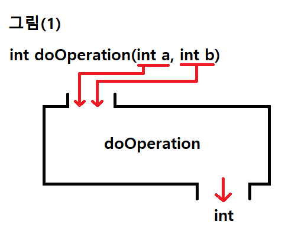
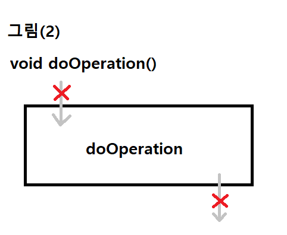

# 자바 라이브 스터디 5주차

#### 목표

```
자바의 Class에 대해 학습하세요.
```

#### 학습할 것

`🟢 completed` `🟡 in progress` `⚪ not done`

- 🟢 객체지향 프로그래밍이란
- 🟢 클래스 정의하는 방법
- 🟡 객체 만드는 방법 (new 키워드 이해하기)
- 🟢 메소드 정의하는 방법
- 🟢 생성자 정의하는 방법
- 🟡 this 키워드 이해하기

#### 과제 (Optional)
- ⚪ int 값을 가지고 있는 이진 트리를 나타내는 Node 라는 클래스를 정의하세요.
- ⚪ int value, Node left, right를 가지고 있어야 합니다.
- ⚪ BinrayTree라는 클래스를 정의하고 주어진 노드를 기준으로 출력하는 bfs(Node node)와 dfs(Node node) 메소드를 구현하세요.
- ⚪ DFS는 왼쪽, 루트, 오른쪽 순으로 순회하세요.

---

## 객체지향 프로그래밍이란?

객체지향 프로그래밍(OOP, Object-Oriented Programming)은 단지 함수와 절차만이 아니라 객체를 기반으로 하는 프로그래밍 방법론이다. 객체는 데이터와 메소드, 또는 동작을 포함한다. 객체지향이론은 **추상화**, **캡슐화**, **상속**, **다형성** 등 4가지 주요 원칙을 중심으로 점차 구체적으로 발전되었다. 

- **추상화**는 사용자의 복잡성을 줄이기 위해 관련없는 세부사항은 무시하면서 개체의 필수적인 세부사항을 노출하는 과정이다. 

- **캡슐화**는 신뢰할 수 있는 사용자(예를 들어, 해당 클래스의 메소드들)만이 접근가능도록 클래스의 **캡슐** 안에 데이터와 내부 메소드들을 안전하게 숨겨준다. 클래스는 데이터와 메소드의 집합이라고 할 수 있는데 클래스 안에 데이터를 숨기고 메소드를 통해서만 사용이 가능하도록 만드는 것이다. 

- **상속**은 기존 유형에서 새 유형을 파생하여 부모-자녀 관계를 설정하는 데 사용된다. 

- **다형성**은 한 개체가 다른 맥락에서 다른 의미를 가질 수 있게 한다.

### OOP의 주요 특징

1. **코드의 재사용성이 높다.** 새 코드를 작성할 때 기존 코드를 이용해 쉽게 작성할 수 있다. 
2. **코드의 관리가 용이하다.** 코드간의 관계를 이용해서 적은 노력으로 쉽게 코드를 변경할 수 있다. 
3. **신뢰성이 높은 프로그래밍을 가능하게 한다.** 제어자와 메소드를 이용해 데이터를 보호하고 올바른 값을 유지하도록 하며, 코드의 중복을 제거해 코드 불일치로 안한 오동작을 방지할 수 있다.

---
## 클래스 정의하는 방법

클래스는 객체를 정의해 놓은 것으로 객체의 설계도 또는 틀이라고 할 수 있고, 객체를 생성하는데 사용된다.

클래스의 바디(`{}` 안의 내용)에는 새 객체를 초기화하기 위한 생성자, 클래스와 그 객체의 상태를 나타내는 필드를 위한 선언, 그리고 클래스의 객체의 행동을 시행할 메소드 등 클래서에서 생성된 객체의 생명주기동안 쓰이는 모든 코드가 포함된다. 클래스를 정의하고 클래스를 통해 객체를 생성하면 객체를 만들때마다 매번 고민할 필요 없이 설계도대로 만들 수 있다.

### 클래스 정의 순서 

- 접근제어자 : `public`, `private`, `protected`, `default`
- 클래스 이름 : 자바 코딩 규칙에 따라 맨 앞글자를 대문자로 쓴다.
- extends 상위클래스 이름 : 하나의 상위클래스만 상속 가능
- implements 인터페이스 목록 : 인터페이스는 다중상속 가능하며 콤마 `,`로 구분해준다.
- {클래스 바디} : 괄호 `{}` 안에 전체 코드 작성

예를 들어 접근의 제한이 없고 `MySuperClass`의 하위클래스이며 `YourInterface`를 구현하는 클래스는 다음과 같이 정의할 수 있다.

```java
public class MyClass extends MySuperClass implements YourInterface {
    // field, constructor, and
    // method declarations
}
```
 
---

## 객체 만드는 방법 (new 키워드 이해하기)

객체는 클래스에 정의된 내용대로 메모리에 생성된 것을 뜻한다. 클래스로부터 객채를 만드는 과정을 클래스의 *인스턴스화*(instantiate)라고 하며 어떤 클래스로부터 만들어진 객체를 그 클래스의 *인스턴스*(instance)라고 한다. 인스턴스는 객체와 같은 의미지만 객체는 모든 인스턴스를 대표하는 포괄적인 의미를 가지며, 인스턴스는 어떤 클래스로부터 만들어진 것인지를 강조하는 보다 구체적인 의미를 갖고 있다. 예를 들어, '책상은 인스턴스다' 보다는 '책상은 객체다'가, '책상은 책상 클래스의 객체다' 보다는 '책상은 책상 클래스의 인스턴스다'라고 하는 것이 더 자연스럽다.

```java
public class CreateObjectDemo {
  public static void main(String[] args) {
    // Declare and create a point object and two rectangle objects.
    Point originOne = new Point();
    Rectangle rectOne = new Rectangle(50, 100);
  }
}
```

위의 클래스에서 첫번째 줄은 Point 클래스의 객체를 생성하고, 두번째 줄은 Rectangle 클래스의 객체를 생성한다. 인스턴스의 멤버변수(속성)를 사용하려면 '참조변수.멤버변수'와 같이 하면 된다. 인스턴스는 참조변수를 통해서만 다룰 수 있고 참조변수의 타입은 인스턴스의 타입과 일치해야 한다. 객체를 생성 순서는 **선언**, **인스턴스화**, **초기화** 순으로, 일반적으로 다음과 같다:

```java
Point originOne; // 클래스의 객체를 참조하기 위한 참조변수 선언
originOne = new Point(); 
  // new 키워드로 클래스 인스턴스 생성 후, 
  // 객체의 주소를 참조변수에 저장. 
  // 이때, 멤버변수는 각 자료형에 해당하는 기본값으로 초기화
originOne.width=10; 
originOne.height=20;
  // 참조변수 originOne에 저장된 주소에 있는 
  // 인스턴스의 멤버변수 width와 height에 각각 10, 20 저장
System.out.println(originOne.getArea(originOne.width, originOne.height));
  // 참조변수 originOne가 참조하고 있는 Point 인스턴스의 getArea() 메소드 호출
```

---

## 메소드 정의하는 방법

**메소드**는 특정 작업을 수행하는 일련의 문장들을 하나로 묶은 것이다. 메소드에 필수적으로 필요한 요소로는 return 타입, 메소드 이름과 소괄호 `()`, 바디를 묶을 중괄호 `{}`만 있으면 된다. 입력값 또는 출력값이 없을 수도 있고, 심지어 두 값 모두 없을 수도 있다. 메소드를 사용할 때ㅐ 내부적으로 어떤 과정을 거쳐 결과를 만들어내는지 전혀 몰라도 사용에 어려움이 없기 때문에 메소드를 내부가 보이지 않는 **블랙박스**라고도 한다.

### 메소드 사용 이유

1. 높은 재사용성

    Java API에서 제공하는 메소드들과 같이 한번 만들어 놓은 메소드는 몇 번이고 호출할 수 잇으며, 다른 프로그램에서도 사용이 가능하다.

2. 중복된 코드 제거

    반복되는 문장들을 묶어서 하나의 메소드로 작성해 놓으면 변경사항이 발행했을 때 메소드 내에서만 수정해주면 되기 때문에 관리가 쉽고 오류 발생가능성도 낮아진다.

3. 프로그램의 구조화

    큰 규모의 프로그램에서는 문장들을 작업 단위로 나눠서 여러개의 메소드에 담아 프로그램의 구조를 단순화시키는 것이 필수적이다. main 메소드는 프로그램 전체 흐름이 한눈에 들어올 정도로 단순하게 구조화해야지만 나중에 문제가 발행한 부분을 찾아 해결하기 용이하다.

### 메소드 정의 순서 

일반적으로 메소드는 여섯개의 요소를 아래 순서로 가진다:

- 접근제어자 : `public`, `private`, `protected`, `default`
- 리턴 타입 : 메소드가 리턴하는 데이터의 타입, 반환하는 값이 없을 시 `void`
- 메소드 이름(파라미터 목록) : 메소드 이름은 [아래](#메소드의-이름) 참고. 괄호 안에는 데이터타입 파라미터 쌍으로 오며 콤마 `,`로 구분해준다. 파라미터 값이 없을 시 빈 괄호 `()`를 반드시 적어준다. 
- {메소드 바디} : 괄호 `{}` 안에 지역변수를 포함한 전체 코드 작성

> 메소드 이름과 파라미터 타입은 메소드 시그니처를 구성한다. 메소드 이름과 매개변수 리스트는 [오버로딩](#메소드-오버로딩) 시에 메소드를 식별하는데 사용된다.

#### 메소드의 이름

코드 규칙에 의해서 메소드이름 첫글자는 소문자로 시작하는 동사형태로 오고, 여러 단어의 조합일 경우 카멜케이스 규칙을 따른다. 보통의 경우 메소드는 클래스 안에서 고유한 이름을 갖지만, 메소드 오버로딩에 의해 메서드의 이름이 다른 메서드와 같을 수 있다.

#### 메소드 오버로딩

자바에서는 메소드 오버로딩이 가능하고, 메소드 시그니처가 다른 메소드들을 구별할 수 있다. 즉, 매개변수 리스트가 다르다면 도일 클래스 내에서 메소드 이름을 가질 수 있다. 

여러가지 타입의 데이터를 그리는 메소드가 들어있는 클래스가 있다고 가정해보자. 각 메소드의 매개변수 타입이 다르다면 같은 이름의 메소드를 중복으로 가질 수 있다는 의미이다.

```java
public class DataArtist {
  public void draw(String str) {
    // method 호출시 수행될 코드
  }
  public void draw(int i) {
     // ...
  }
  public void draw(float f) {
     // ...
  }
  public void draw(int i, float f) {
     // ...
  }
}
```

오버로드 된 메소드는 매개변수의 타입과 수로 구별되며, 컴파일러는 리턴 타입을 고려하지 않는다. 따라서 한 클래스 안에서 정의되는 메소드 이름과 매개변수의 타입과 수가 똑같다면 메소드가 반환하는 리턴타입이 다르다고 해도 중복으로 구현할 수 없다.

### 메소드의 선언과 구현

메소드는 크게 `선언부`와 `구현부`로 이우러진다. 메소드를 정의한다는 것은 이 두 부분을 작성하는 것을 뜻하며 형식은 다음과 같다:

```java
반환타입 메소드이름(타입 변수명, 타입 변수명, ...)  //선언부
{
  //구현부
}
```

#### 메소드 선언부(method declaration, method header)

메소드 선언부는 메소드가 작업을 수행하기 위해 어떤 값들을 필요로 하고 작업 결과로 어떤 타입의 값을 반환하는지에 대한 정보를 제공한다. 만약 반환값이 없는 경우 반환타입으로 `void를 적어준다.

예를 들어 그림(1)의 메소드는 두 개의 정수를 입력받고 특정한 연산을 수행한 후 결과값 정수를 반환한다. 반면 그림(2)의 메소드는 매개변수와 리턴값이 전부 없다.




> 메소드의 선언부를 변경하게 되면 그 메소드가 호출되는 모든 곳도 같이 변경해야 하기 때문에 후에 변경사항이 발생하지 않도록 신중히 작성해야 한다. 

#### 매개변수 선언(parameter declaration)

매개변수는 메소드가 작업을 수행하는데 필요한 값들을 제공받는 것이다. 일반적인 변수선언과 다르게 두 변수의 타입이 같아도 변수의 타입을 생략할 수 없다. 매개변수가 필요 없다면 괄호 안에 아무것도 적지 않는다.

```java
int doOperation(int a, int b){ } // 가능
int doOperation(int a, b){ } // 에러 발생
```

> 매개변수도 메소드 내에 선언된 것으로 간주되기 때문에 **지역변수**이다.

### 리턴문

리턴문은 현재 실행중인 메소드를 종류하고 호출한 메소드로 되돌아간다. 모든 메소드에는 적어도 하나의 리턴문이 있어야 한다. 그러나 리턴타입이 `void`인 경우 컴파일러가 메소드의 마지막에 자동으로 리턴문을 추가해준다. 

메소드의 리턴타입이 `void`가 아닌 경우 구현부 안에 반드시 `return 반환값`이 포함되어야 하고, 메소드를 수행한 결과인 반환값의 타입이 리턴타입과 일치해야 한다. 매개변수가 여려개를 선언할 수 있는 것과 다르게 리턴문은 하나의 값만 반환할 수 있다. 

반환값으로 주로 변수가 오지만 수식도 올 수 있고 이 경우 수식의 결과값이 반환된다.

```java
void doOperation(){
  //구현부
  return; //생략 가능
}

int add(int a, int b){
  return a+b;  // 생략 불가. 리턴타입과 일치.
}
```

```java
int max(int a, int b){
  if(a>b) return a;   // 조건이 거짓일 경우 리턴문이 실행되지 않아 에러 발생
}

//아래와 같이 변경
int max(int a, int b){
  if(a>b) return a;
  return b;
}
```

### 매개변수의 유효성 검사

메소드의 구현부를 작성할때 제일 먼저 매개변수 값이 절절한 지 확인해야 한다. 타입만 맞다면 어떤 값도 매개변수를 통해 넘어올 수 있기 때문에 가능한 모든 경우의 수를 고려하고 그에 대비해 코드를 작성한다.

예를 들어 매개변수로 실수 두개를 받아 나누는 메소드를 구현할 때, 0으로 나누면 에러가 발생하기 때문에 계산 전에  divisor의 값이 0인지 확인한다. 만약 divisor의 값이 0이라면 리턴문을 이용해 메소드에서 빠져나온다.

```java
double divide(int x, int y){
  if(y==0){
    return 0; // 매개변수가 유효하지 않으므로 메소드 종료
  }
  return x/(double)y;
}
```

---

## 생성자 정의하는 방법

생성자는 인스턴스가 생성될 때 호출되는 `인스턴스 초기화 메소드`로, 인스턴스 변수의 초기화 작업에 주로 사용되며 인스턴스 생성 시에 실행되어야 할 작업을 위해서도 사용된다.

생성자의 이름은 클래스의 이름과 같아야 하며, 생성자는 리턴값이 없다. 생성자도 오버로딩이 가능하기 때문에 한 클래스에 여러개의 생성자를 정의할 수 있다. 

```java
클래스이름(타입 변수명, 타입, 변수명, ...){
  //매개변수 없는 생성자
  클래스이름(){
    // ...
  }
  //매개변수 있는 생성자
  클래스이름(String str, int a){
    // ...
  }
}
```

**주의!** 생성자가 인스턴스를 생성하는 것이 아니라 연산자 `new`가 인스턴스를 생성하는 것이다. 생성자는 단순히 인스턴스 변수들의 초기화에 사용되는 메소드일 뿐이다. MyObject 클래스의 인스턴스를 생성하는 코드롤 에로 들어 수행과정을 단계별로 나누면 다음과 같다:

```
MyObject mo=new MyObject();
```

1. 연산자 `new`에 의해 메모리(heap)에 MyObject 클래스의 인스턴스가 생성된다.
2. 생성자 `MyObject()`가 호출되어 수행된다.
3. 연산자 `new`의 결과로, 생성된 MyObject 인스턴스의 주소가 반환되어 참조변수 mo에 저장된다.

### 기본생성자(default constructor)

모든 클래스에는 적어도 하나 이상의 생성자가 정의되어 있어야 한다. 그러나 클래스에 생성자를 따로 정의하지 않아도 컴파일러가 제공하는 기본생성자가 있어서 인스턴스 생성이 가능하다. 단, 생성자가 하나라도 정의되어 있다면 기본생성자가 자동으로 추가되지 않는다.

#### 기본생성자 형태 

```java
클래스이름(){
  
}
```

> 컴파일러가 자동으로 추가해주는 생성자는 매개변수도 없고 내용도 없다.

### 매개변수가 있는 생성자

생성자도 메소드처럼 매개변수 값을 받아서 인스턴스의 초기화 작업에 사용할 수 있다. 인스턴스마다 각각 다른 값으로 초기화되어야 하는 경우가 많아서 매개변수를 사용한 초기화는 매우 유용하다.

```java
class MyObject{
  int width;
  int height;

  // 매개변수 있는 생성자
  MyObject(int w, int h){
    width=w;
    height=h;
  }
}
```

MyObject 인스턴스를 생성할 때 기본생성자를 사용하면 넓이, 높이를 따로 초기화해야 하지만, 매개변수가 있는 생성자 `MyObject(int w, int h)`를 사용하면 인스턴스 생성 시에 원하는 값을 초기화할 수 있다.

```java
//기본생성자 사용시
MyObject mo=new MyObject();
mo.width=10;
mo.height=20;

//매개변수 있는 생성자 사용시
Myobject mo=new MyObject(10,20);
```

---

## this 키워드 이해하기

### 생성자에서 다른 생성자 호출하기 - `this()`, `this`

같은 클래스의 멤버들 간에 서로 호출할 수 있는 것처럼 생성자들 같에도 서로 호출이 가능하다. 단, 생성자의 이름으로 클래스일므 대신 `this`를 사용하고, 한 생성자에서 다른 생성자를 호출할 때는 반드시 첫 줄에서만 호출이 가능하다.

```java
class MyObject{
  String color;
  int width;
  int height;

  // 생성자1
  MyObject(){
    this("blue", 10, 20); //생성자3 호출
  }

  // 생성자2
  MyObject(String color){
    this(color, 10, 20); 
  }

  // 생성자3
  MyObject(String color, int width, int height){
    this.color=color;
    this.width=width;
    this.height=height;
  }
}
```

`생성자1`에서 `생성자3`을 호출할때처럼 생성자간의 호출에는 생성자의 이름 대신 this를 사용하고, 첫째 줄에서 호출해야 한다. 

`생성자3`에서 매개변수로 선언된 변수의 이름이 인스턴스 변수와 같을 경우에 인스턴스 변수 앞에 `this`를 붙여준다. `this`는 참조변수로 인스턴스 자신을 가리킨다. 참조변수를 통해 인스턴스의 멤버에 접근할 수 있는 것처럼 `this`로 인스턴스 변수에 접근할 수 있다. 

단, `this`를 사용할 수 잇는 것은 인스턴스 멤버 뿐이다. static 메소드는 인스턴스를 생성하지 않고도 호출될 수 있기 때문에 static 메소드가 호출된 시점에 인스턴스가 존재하지 않을 수 있어서 `this`를 사용할 수 없다.

> **`this`** 인스턴스 자신을 가리키는 참조변수, 인스턴스의 주소가 저장되어 있다. 모든 인스턴스 메소드에 지역변수로 숨겨진 채 존재한다.
>
> **`this()`, `this(매개변수)`** 생성자. 같은 클래스의 다른 생성자를 호출할 때 사용한다.

<small>**참고** `this`는 참조변수, `this()`는 생성자로 비슷하게 생겼으니 완전히 다른 것이다.</small>

---

## 참고자료

1. 남궁성. *Java의 정석 3판.* 도우출판, 2016.

2. Evans, Benjamin J. and David Flanagan. *Java in a Nutshell.* O'Reilly Media, 2019.

3. https://howtodoinjava.com/java/oops/object-oriented-programming/

4. https://docs.oracle.com/javase/tutorial/java/javaOO/index.html

<!-- 객체지향의 사실과 오해 -->