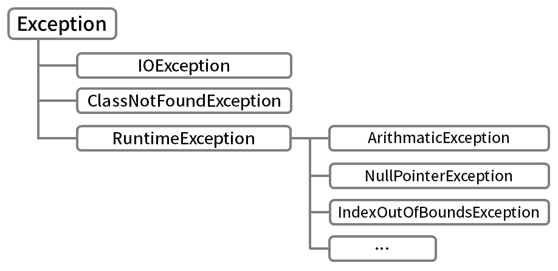

# [자바 라이브 스터디] 9주차 - 예외 처리

#### 목표

```
자바의 예외 처리에 대해 학습하세요.
```

#### 학습할 것

`🟢 completed` `🟡 in progress` `⚪ not done`

- ⚪ [자바에서 예외 처리 방법 (try, catch, throw, throws, finally)](#자바에서-예외-처리-방법)
- 🟢 [자바가 제공하는 예외 계층 구조](#자바가-제공하는-예외-계층-구조)
- 🟢 [Exception과 Error의 차이는?](#Exception과-Error의-차이)
- 🟢 [RuntimeException과 RE가 아닌 것의 차이는?](#RuntimeException과-RE가-아닌-것의-차이)
- ⚪ [커스텀한 예외 만드는 방법](#커스텀한-예외-만드는-방법)
<!-- 
try-with-resources 
  try-catch-finally 대신 새용 -> 기존보다 간결하고 안전한 코드 사용이 가능해짐
-->

---

## 자바에서 예외 처리 방법

### try-catch

### throw

### throws

### fianlly

---

## 자바가 제공하는 예외 계층 구조



예외 클래스들은 
  1. Exception 클래스와 그 자손들(사용자 실수 등의 외부요인으로 발생하는 예외)
  2. RuntimeException 클래스와 그 자손들(프로그래머 실수로 발행하는 예외)

이 두개의 그룹으로 나눠질 수 있다.

---

## Exception과 Error의 차이

- Exception(예외) : 프로그램에 문제가 생겨도 수습할 수 있는 덜 심각한 오류. 적절한 코드를 미리 작성해서 프로그램의 비정상적 종료를 예방할 수 있다.
- Error(에러) : 일단 발생하면 복구할 수 없는 심각한 오류. 프로그램의 비정상적 종료를 막을 수 없다.

---

## RuntimeException과 RE가 아닌 것의 차이

### RuntimeException

예외 계층 구조에서 봤듯이 RuntimeException은 주로 프로그래머 실수로 발생되는 예외들이다. 

- ArithmaticException : 정수를 0으로 나눔
- NullPointerException : 값이 null인 참조변수의 멤버를 호출
- ArrayIndexOutOfBoundsException : 배열의 범위를 벗어남
- ClassCastException : 클래스간의 형변환이 잘못됨

### RE가 아닌 것

RE가 아닌 다른 예외들은 Exception 클래스들로 사용자 동작에 의해 발생한다.

- FileNotFoundException : 존재하지 않는 파일 이름 입력
- ClassNotFoundException : 잘못된 클래스 이름 입력
- DataFormatException : 잘못된 데이터 형식 입력

---

## 커스텀한 예외 만드는 방법


---

## 참고자료

- 남궁성. *Java의 정석 3판.* 도우출판, 2016.
- Evans, Benjamin J. and David Flanagan. *Java in a Nutshell.* O'Reilly Media, 2019.
- https://docs.oracle.com/javase/specs/jls/se15/html/jls-11.html
- https://howtodoinjava.com/java/exception-handling/
- http://www.tcpschool.com/java/java_exception_intro
