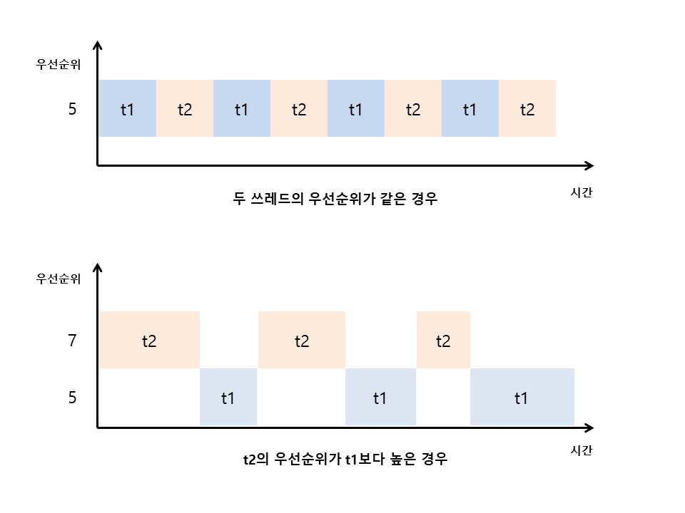
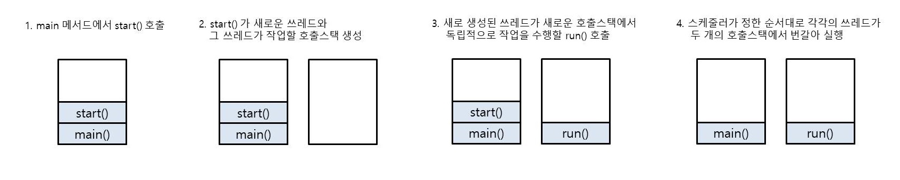
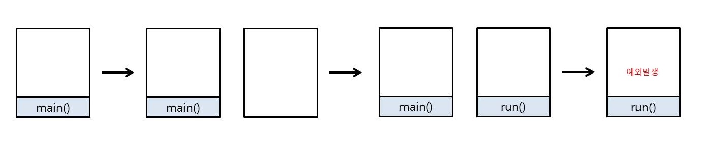
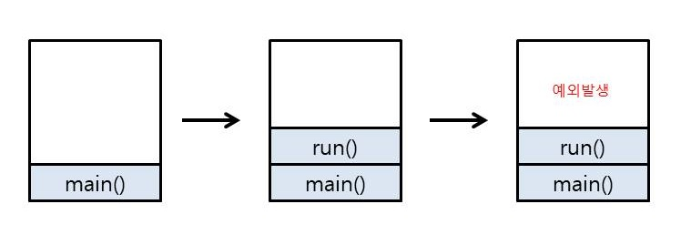

# 자바 라이브 스터디 10주차

#### 목표

```
자바의 멀티쓰레드 프로그래밍에 대해 학습하세요.
```

#### 학습할 것

`🟢 completed` `🟡 in progress` `⚪ not done`

- 🟢 Thread 클래스와 Runnable 인터페이스
- 🟢 쓰레드의 상태
- 🟢 쓰레드의 우선순위
- 🟢 Main 쓰레드
- 🟡 동기화
- 🟡 데드락

<!-- 
필수 - runnable, thread 무슨 메서드이고 무슨 상태인지 우선순위는 어떻게 되는지
      main thread, 동기화란, 어떻게 처리되나
      lock으로 쓰는 obj, lock의 개념, lock을 잡는다?, 종류, deadlock
선택 - callable, threadpool
      ForkJoinPool https://docs.oracle.com/javase/8/docs/api/java/util/concurrent/ForkJoinPool.html
 -->


---

## 프로세스와 쓰레드

프로세스는 프로그램을 실행하면 필요한 메모리와 데이터 등의 자원을 할당받고 쓰레드는 이 자원을 이용해 실제로 작업을 수행한다. 모든 프로세스는 최소한 하나 이상의 쓰레드가 존재하고 둘 이상의 쓰레드를 가진 프로세스를 **멀티쓰레드 프로세스**라고 한다. 

지금까지 공부한 내용들은 한번에 하나의 작업만 실행하는 싱글 쓰레드에 대해 보았는데, JVM은 한번에 여러 쓰레드가 작업하는 것을 지원한다. 멀티쓰레드는 공유 주기억 장치에 있는 값과 객체에 대해 작동하는 각각의 코드를 실행한다. 멀티쓰레드는 여러개의 하드웨어 프로세서를 갖거나, 하나의 하드웨어 프로세서를 시간분할하거나, 여러개의 하드웨어 프로세서를 시간분할 함으로써 지원될 수 있다.

쓰레드를 만들기 위해서는 반드시 `Thread` 클래스의 객체를 만들어야 한다. 쓰레드는 해당하는 `Thread` 객체에서 `start()` 메서드를 호출할때 작업을 시작한다.

멀티쓰레드의 동작은 특히나 제대로 동기화 되지 않았을때 헷갈릴 수 있다. 멀티쓰레드에서 업데이트된 공유자원의 read에 의해 어떤 값이 보일 것인지에 대한 규칙이 있다. 

### 멀티쓰레딩의 장단점

멀티쓰레딩의 장점은 다음과 같다

- CPU의 사용률을 향상시킨다.
- 자원을 보다 효율적으로 사용할 수 있다.
- 사용자에 대한 응답성이 향상된다.
- 작업이 분리되어 코드가 간결해진다.

여러 사용자에게 서비스를 해주는 서버 프로그램의 경우 멀티쓰레드로 작성하는 것은 필수적이다. 하나의 서버 프로세스가 여러개의 쓰레드를 생성해서 쓰레드와 사용자의 요청이 일대일로 처리되도록 프로그래밍해야 한다.

그러나 멀티쓰레드 프로세스는 여러 쓰레드가 같은 프로세스 내에서 자원을 공유하며 작업하기 때문에 동기화(synchronization), 교착상태(deadlock)와 같은 문제가 있을 수 있어서 신중하게 프로그래밍해야 한다.

---

## Thread 클래스와 Runnable 인터페이스

쓰레드를 구현하는 방법은 Thread 클래스를 상속받는 방법과 Runnable 인터페이스를 구현하는 방법 두가지가 있다. Thread를 상속받으면 다른 클래스를 상속받을 수 없기 때문에 Runnable 인터페이스를 구현하는 방법이 일반적이다. 또한 Runnable 인터페이스를 구현하면 재사용성이 높고 코드의 일관성을 유지할 수 있기 때문에 더 객체지향적이다. 

Runnable 인터페이스를 구현하는 것은 쓰레드의 동작을 특별히 바꾸는 것이 아니라 그저 쓰레드가 동작시킬 무언가를 전달하는 것 뿐이다. Thread 클래스를 상속받은 자식클래스는 어떤 동작을 하든 쓰레드 안에서 이루어진다. 

만약 JDK4나 그 이하버전에서 작업을 한다면 `start()` 메서드를 실행하지 않은 쓰레드가 있다면 그 쓰레드 메모리 누수가 생긴다. (http://bugs.java.com/bugdatabase/view_bug.do;jsessionid=5869e03fee226ffffffffc40d4fa881a86e3:WuuT?bug_id=4533087)

Java 1.5부터 버그가 고쳐졌지만 1.4 이하에서는 여전히 버그가 생긴다. 이 문제는 프로그램을 빌드할 때 쓰레드가 내부 쓰레드 테이블의 참조리스트에 추가되는데, `start()` 메소드가 완료될까지 이 리스트에서 지워지지 않고 쓰레드가 그 참조에 있는 한 가비지 컬렉션이 일어나지 않기 때문에 발생하는 것이다.

```java
public class ThreadAndRunnable {
    public static void main(String[] args) {
        // 1. Thread의 자손클래스 인스턴스 생성
        MyThread t1 = new MyThread(); 
        
        // 2. Runnable을 구현한 클래스의 인스턴스 생성
        MyRunnable r = new MyRunnable();  
        Thread t2 = new Thread(r);  // 생성자 Thread(Runnable target)
        
        // 3. 두번째 방법을 줄여쓴 코드
        Thread t3 = new Thread(new MyRunnable()); 

        t1.start();
        t2.start();
        t3.start();
    }
}

// Thread 클래스 상속
class MyThread extends Thread {

    public void run(){
        System.out.println("MyThread is " + getName()); 
        // getName() -> Thread 클래스의 메서드 직접 호출 가능
    }
}

// Runnable 인터페이스 구현
class MyRunnable implements Runnable {

    @Override
    public void run() {
        System.out.println("MyRunnable is " + Thread.currentThread().getName());  
        // Thread.currentThread().getName() 
        //   -> Thread 클래스의 static 메서드인 currentThread()를 호출해서 쓰레드에 대한 참조를 얻어야 메서드 호출 가능

    }
}
```

> 결과

```
MyThread is Thread-0
MyRunnable is Thread-1
MyRunnable is Thread-2
```

### 자주 쓰이는 쓰레드 메서드

- `long	getId()` : 쓰레드의 식별자를 반환한다. 이 식별자는 쓰레드의 생명주기동안 동일하게 유지된다.
- `int	getPriority()` : 쓰레드의 우선순위를 반환한다.
- `void	setPriority(int newPriority)` : 쓰레드의 우선순위를 변경해준다. 다만 실제로 쓰레드의 우선순위를 어떻게 다룰지는 스케줄러가 결정한다- (우선순위가 낮은 쓰레드는 우선순위가 높은 쓰레드가 대기상태인 경우 동작하지 않는 등). 대부분의 경우 `setPriority()` 메서드는 스케줄러가 우선순위를 - 결정하는 데 영향을 주지는 못한다.
- `void	setName(String name)` : 쓰레드의 이름을 설정해준다. `Thread(Runnable target, String name)`, `Thread(String name)`, `void setName(String name)`과 같은 생성자나 메서드를 통해 지정하거나 변경할 수 있다.
- `String	getName()` : 쓰레드의 이름을 반환한다.
- `Thread.State	getState()` : 쓰레드의 현재상태를 반환한다.
- `boolean	isAlive()` : 쓰레드가 살아있는지 확인한다.
- `void	start()` : 쓰레드를 실행시킨다.
- `void	interrupt()` : 쓰레드가 `sleep()`, `wait()`, `join()` 메서드 호출로 블락되어 있을때 해당 쓰레드에 `interrupt()` 메서드를 호출하면 - InterruptedException 예외를 던지고 `sleep()`, `wait()`, `join()`에서 빠져나온다.
- `void	join()`, `void	join(long millis)`, `void	join(long millis, int nanos)` : 이 쓰레드가 소멸될 때까지 기다린다. `()`안에 밀리초 단위 또는 - 밀리초+나노초 단위로 기다릴 시간을 지정해줄 수 있다.
- `void	setDaemon(boolean on)` : boolean 값을 이용해 사용자 쓰레드 또는 데몬 쓰레드로 지정해줄 수 있다. 
- `void	setUncaughtExceptionHandler(Thread.UncaughtExceptionHandler eh)` : 검색되지 않은 예외로 인해 이 스레드가 갑자기 종료될 때 호출되는 처리기를 설정한다.

#### 사용 예시

```java
public class UsefulThreadMethods {
    public static void main(String[] args) throws InterruptedException {
        NamedThread t1 = new NamedThread();
        Thread t2 = new Thread(new NamedRunnable(), "named runnable");
        t2.setDaemon(true);
        t2.start();

        Thread.sleep(3000);

        // start() 호출 전 상태
        System.out.println("t1 Current state : " + t1.getState());

        t1.start();

        // start() 호출 후 상태
        System.out.println("t1 Current state : " + t1.getState());
    }
}

class NamedThread extends Thread {
    public void run() {
        setName("named thread");
        System.out.println(toString() + ", ID : " + getId() + ", DaemonThread : " + isDaemon());
    }
}

class NamedRunnable implements Runnable {
    public void run(){
        while (true){
            try {
                Thread.sleep(1000);
                System.out.println(Thread.currentThread().toString() + ", ID : " + Thread.currentThread().getId() + ", DaemonThread : " + Thread.currentThread().isDaemon());
            } catch (InterruptedException e) {
                e.printStackTrace();
            }
        }
    }
}
```

> 결과

```
Thread[named runnable,5,main], ID : 14, DaemonThread : true
Thread[named runnable,5,main], ID : 14, DaemonThread : true
t1 Current state : NEW
t1 Current state : RUNNABLE
Thread[named thread,5,main], ID : 13, DaemonThread : false
```

### 쓰레드에서 사용하면 안되는 메서드

역호환성 요구사항에 의해 자바 쓰레드 API에 포함은 되어있지만 사용하면 안될 메서드들도 알아두는 것이 좋다.
- `Thread.stop()` : `Thread.stop()` 메서드는 concurrent safety를 위반하지 않고 사용하는 게 거의 불가능하다. `stop()`은 쓰레드가 객체를 적합한 상태로 만들 어떤 기회도 주지 않고 쓰레드를 즉시 죽여버린다. 이것은 concurrent safety 원칙에 정면으로 반대되기 때문에 절대 사용하면 안된다.
- `suspend()`, `resume()`, `countstackframes()` : `suspend()` 메서드를 호출하면 해당 쓰레드가 잡고있는 모니터를 놓지 않기 때문에 다른 쓰레드들이 그 모니터를 잡으려고 시도하면 데드락 상태가 된다.
- `destroy()` : 이 메서드는 원래는 클린업 없이 쓰레드를 없애기 위해 고안되었지만 구현 자체가 되지 않았다. 만약 구현되었다면 `suspend()`와 같은 데드락 문제를 발생시켰을 것이다.

---

## 쓰레드의 상태

모든 운영시스템은 쓰레드에 대한 관점이 있는데 세부적으로 조금씩 다를 수 있다. 자바는 이런 세부사항을 최대한 추상화시키기 위해 `Thread.State`라고 불리는 enum을 갖고 있다. `Thread.State`의 값은 쓰레드 생애주기의 전체적인 개요를 보여준다. 쓰레드는 특정 순간에 단 하나의 상태만 가질 수 있다.

- **NEW** : 쓰레드가 생성되었지만 `start()` 메서드는 호출하지 않은 상태이다. 모든 쓰레드는 이 상태에서 시작한다.
- **RUNNABLE** : 쓰레드 스케줄링되면 실행될 수 있는 상태이거나 쓰레드가 실행중인 상태이다. JVM에서 실행되는 쓰레드가 이 상태이다.
- **BLOCKED** : 쓰레드가 실행중이 아니고 동가화된 메서드나 block에 들어갈 수 있게 모니터의 lock을 잡으려고 기다리는 상태이다.
- **WAITING** : 쓰레드가 `Object.wait()` 또는 `Thread.join()` 메서드를 호출해서 다른 쓰레드가 특정 행동을 할때까지 무기한 대기중인 상태이다.
- **TIMED_WAITING** : 쓰레드가 시간값이 있는 `Thread.sleep()`메서드나 `Object.wait()`, `Thread.join()` 메서드를 호출해서 그 시간이 지날 때까지 대기중인 상태이다.
- **TERMINATED** : 쓰레드의 `run()` 메소드가 정상적으로 종료되었거나 예외를 던지면서 모든 동작을 끝낸 상태이다. 


이미지 출처 : https://www.baeldung.com/wp-content/uploads/2018/02/Life_cycle_of_a_Thread_in_Java.jpg

#### NEW , RUNNABLE

```java
public class NewState {
    public static void main(String[] args) throws InterruptedException {
        Runnable runnable = new NewRunnable();
        Thread t = new Thread(runnable);
        System.out.println(t.getState());   // NEW

        t.start();
        System.out.println(t.getState());   // RUNNABLE
    }
}

class NewRunnable implements Runnable{
    @Override
    public void run() {}
}

```

#### BLOCKED

```java
public class BlockedState {
    public static void main(String[] args) throws InterruptedException {
        Thread t1 = new Thread(new BlockedRunnable());
        Thread t2 = new Thread(new BlockedRunnable());

        t1.start();
        t2.start();

        Thread.sleep(1000);

        System.out.println(t2.getState());  // BLOCKED
        System.exit(0);
    }
}

class BlockedRunnable implements Runnable {
    @Override
    public void run() {
        commonResource();
    }

    public static synchronized void commonResource() {
        while(true) {
            // t1이 이 메서드를 벗어나지 않았는데 t2가 실행하려고 하는 상황을 만들어 주기 위한 무한루프
        }
    }
}
```

#### WAITING

```java
public class WaitingState implements Runnable{
    public static Thread t1;

    public static void main(String[] args) {
        t1 = new Thread(new WaitingState());
        t1.start(); // WAITING
    }

    public void run(){
        Thread t2 = new Thread(new WaitingRunnable());
        t2.start();
        try {
            t2.join();
        } catch (InterruptedException e) {
            e.printStackTrace();
        }
    }
}

class WaitingRunnable implements Runnable {
    public void run() {
        System.out.println(WaitingState.t1.getState());
    }
}
```

#### TIMED_WAITING

```java
public class TimedWaitingState {
    public static void main(String[] args) throws InterruptedException {
        Thread t = new Thread(new TimedWaitingRunnable());
        t.start();
        Thread.sleep(1000);
        System.out.println(t.getState()); // TIMED_WAITING
    }
}

class TimedWaitingRunnable implements Runnable{
    @Override
    public void run() {
        try {
            Thread.sleep(5000);
        } catch (InterruptedException e) {
            e.printStackTrace();
        }
    }
}
```

#### TERMINATED

```java
public class TerminatedState implements Runnable{
    public static void main(String[] args) throws InterruptedException {
        Thread t = new Thread(new TerminatedState());
        t.start();
        Thread.sleep(1000); // 쓰레드 t가 실행되고 끝나는 텀 만들기 위함
        System.out.println(t.getState()); // TERMINATED
    }

    @Override
    public void run() {

    }
}
```

---

## 쓰레드의 우선순위

쓰레드는 우선순위(priority)라는 속성을 가진다. 이 우선순위의 값에 따라 쓰레드가 얻는 실행시간이 달라진다. 쓰레드가 수행하는 작업의 중요도에 따라 쓰레드의 우선순위를 서로 다르게 지정해 특정 쓰레드가 더 많은 작업시간을 갖도록 할 수 있다. 시각적인 부분이나 사용자에게 빠르게 반응해야 하는 작업을 하는 쓰레드의 우선순위가 다른 쓰레드에 비해 높아야 한다.

#### 쓰레드의 우선순위 지정하기

쓰레드가 가질 수 있는 우선순위의 범위는 1~10이고 순자가 높을수록 우선순위가 높다. 쓰레드의 우선순위는 쓰레드를 생성한 쓰레드로부터 상속받는다. main 메서드를 실행하는 쓰레드의 우선순위는 5이고 따라서 main 메서드에서 생성하는 쓰레드의 우선순위도 자동적으로 5가 된다.

쓰레드의 우선순위는 절대값이 아니라 단지 상대값일 뿐이다. 따라서 우선순위가 높다고 하더라도 우선순위가 높은 쓰레드보다 더 빨리 수행되는 것은 아니다. 다만 우선순위가 높은 쓰레드가 좀 더 많이 실행큐에 포함되고 좀 더 많은 작업시간을 할당받는 것이다.

#### Thread.java

```java
// The minimum priority that a thread can have.
public static final int MIN_PRIORITY = 1;

// The default priority that is assigned to a thread.
public static final int NORM_PRIORITY = 5;

// The maximum priority that a thread can have.
public static final int MAX_PRIORITY = 10;

// Returns this thread's priority.
public final int getPriority() {
    return priority;
}

// Changes the priority of this thread.
public final void setPriority(int newPriority) {
    ...

    // 지정한 우선순위가 가질수 있는 우선순위의 범위를 벗어나면 예외를 던진다.
    if (newPriority > MAX_PRIORITY || newPriority < MIN_PRIORITY) {
        throw new IllegalArgumentException();
    }

    if((g = getThreadGroup()) != null) {
        ...
        setPriority0(priority = newPriority);
    }
}
```

#### 우선순위 지정해주기

```java
public class ThreadPriority {
    public static void main(String[] args) {
        DashThread t1 = new DashThread();
        SlashThread t2 = new SlashThread();

        t2.setPriority(7);

        System.out.println("DashThread t1 priority : " + t1.getPriority());
        System.out.println("SlashThread t2 priority : " + t2.getPriority());

        t1.start();
        t2.start();
    }
}

class DashThread extends Thread {
    public void run(){
        for (int i = 0; i < 300; i++){ System.out.print("-"); }
    }
}

class SlashThread extends Thread {
    public void run(){
        for (int i = 0; i < 300; i++) { System.out.print("/"); }
    }
}
```

> 결과

```
DashThread t1 priority : 5
SlashThread t2 priority : 7
-///////////////////////////////////-/////////////
//////////////////////////////////////////////////
//////////////////////////////////////////////////
//////////////////////////////////////////////////
//////////////////////////////////////////////////
//-------------------------------/////////////////
///////////--------//////////////////////---------
--------------------------------------------------
--------------------------------------------------
--------------------------------------------------
--------------------------------------------------
--------------------------------------------------
```

#### 우선순위의 범위를 벗어나서 예외를 던지는 경우

```java
public class PriorityException extends Thread{
    public static void main(String[] args) {
        Thread t = new PriorityException();
        t.setPriority(11);
    }
}
```

> 결과

```
Exception in thread "main" java.lang.IllegalArgumentException
	at java.base/java.lang.Thread.setPriority(Thread.java:1141)
	at week10.PriorityException.main(PriorityException.java:6)
```

#### 우선순위에 따라 할당되는 시간



위의 그림은 싱글코어에서 쓰레드의 우선순위가 같을 때와 우선순위가 다를 때 각 쓰레드에 주어지는 실행시간의 양을 보여준다. 그렇지만 멀티코어에서는 쓰레드의 우선순의가 따른 차이가 거의 없다. 멀티코어라고 해도 OS에 따라 스케줄링 방식이 다르기 때문에 쓰레드의 우선순위를 다르게 해서 실행하고 싶다면 특정 OS의 스케줄링 정책을 직접 확인해봐야 된다.

작업에 우선순위를 설정하는 것이 필요하다면 쓰레드에 우선순위를 주는 대신 작업에 우선순위를 둬서 PriorityQueue에 저장하고 우선순위가 높은 작업이 먼저 처리되도록 하는 것이 나을 수 있다.

---

## Main 쓰레드

main 메서드의 작업을 수행하는 쓰레드를 main 쓰레드라고 한다. 프로그램을 실행하면 기본적으로 하나의 쓰레드를 생성하고 그 쓰레드가 main 메서드를 호출해서 작업을 수행하는 것이다.

main 메서드가 수행을 마쳤더라고 다른 쓰레드가 아직 작업을 마치지 않았다면 프로그램이 종료되지 않는다. 즉, 실행중인 사용자 쓰레드가 하나도 없을때만 프로그램이 종료된다. 

모든 쓰레드는 독립적인 작업을 수행하기 위해 자신만의 호출스택이 필요하다. 새로운 쓰레드를 생성할때마다 새로운 호출스택이 생성되고 쓰레드가 종료되면 작업에 사용된 호출스택은 소멸된다.



호출스택이 하나일 경우 가장 위에 있는 메서드가 현재 실행중인 메서드이고 나머지 메서드들은 대기상태이다. 그렇지만 호출스택이 둘 이상일 때는 가장 위에 있는 메서드라도 대기상태에 있을 수 있다. 작업을 마친 쓰레드는 호출스택이 모두 비워지면서 그 쓰레드가 사용하던 호출스택은 사라진다.

#### `start()`로 호출한 경우

```java
public class MainThreadStart extends Thread{
    public static void main(String[] args) {
        Thread t = new MainThreadStart();

        t.start();
    }
    public void run(){
        try {
            throw new Exception();
        } catch (Exception e) {
            e.printStackTrace();
        }
    }
}
```

> 결과

```
java.lang.Exception
	at week10.MainThreadStart.run(MainThreadStart.java:11)
```



#### `run()`으로 호출한 경우

```java
public class MainThreadRun extends Thread{
    public static void main(String[] args) {
        Thread t = new MainThreadRun();

        t.run();
    }

    public void run() {
        try {
            throw new Exception();
        } catch (Exception e) {
            e.printStackTrace();
        }
    }
}
```
> 결과
```
java.lang.Exception
	at week10.MainThreadRun.run(MainThreadRun.java:12)
	at week10.MainThreadRun.main(MainThreadRun.java:7)
```



### 데몬 쓰레드

데몬 쓰레드(deamon thread)란 다른 일반 쓰레드의 작업을 돕는 보조적인 역할을 하는 쓰레드를 말한다. 데몬 쓰레드는 사용자 쓰레드가 모두 종료되면 더는 할 일이 없기 때문에 데몬 쓰레드 역시 자동으로 종료된다. 쓰레드를 실행하기 전에 setDaemon() 메소드를 호출하여 데몬 쓰레드로 설정하는 것 외에 데몬 쓰레드의 생성 방법과 실행 방법은 모두 사용자 쓰레드와 같다. 

사용자 쓰레드에서 모든 동작이 끝나면 데몬쓰레드 안에 있는 finally 블럭을 포함한 어떤 코드도 실행되지 않기 때문에 데몬쓰레드에서의 무한루프는 프로그램이 종료되는데 문제가 되지 않는다. 그리고 같은 이유로 I/O 작업에는 데몬스레드를 사용하지 않는 것이 좋다.

데몬 쓰레드는 주로 일정 시간마다 자동으로 수행되는 저장 및 화면 갱신 등에 이용된다.

```java
public class DaemonThread implements Runnable{
    private static Boolean autosave = false;
    
    public static void main(String[] args) throws InterruptedException {
        Thread t = new Thread(new DaemonThread());
        t.setDaemon(true);  // 쓰레드 t를 데몬쓰레드로 설정
        t.start();

        for (int i = 1; i <= 10; i++) {
            Thread.sleep(1000); // 1초마다
            System.out.println("writing demo " + i);

            if(i>3){
                autosave=true;
            }
        }

        System.out.println("writing completed");
    }

    @Override
    public void run() {
        // 쓰레드 무한반복
        while(true){
            try {
                Thread.sleep(3000); // 3초마다
            } catch (InterruptedException e) {
                e.printStackTrace();
            }
            
            // i>3 이면 autosave=true 이므로 3초 이후부터 3초 간격으로 출력
            if(autosave){
                System.out.println("autosaved");
            }
        }
    }
}
```

> 결과

```
writing demo 1
writing demo 2
writing demo 3
writing demo 4
writing demo 5
autosaved
writing demo 6
writing demo 7
writing demo 8
autosaved
writing demo 9
writing demo 10
writing completed
```

#### 가비지 컬렉터(garbage collector)

데몬 스레드를 이용하는 가장 대표적인 예가 바로 가비지 컬렉터(garbage collector)이다. 가비지 컬렉터는 프로그래머가 동적으로 할당한 메모리 중 더 이상 사용하지 않는 영역을 자동으로 찾아 해제해 주는 데몬 스레드이다.

자바에서는 프로그래머가 메모리에 직접 접근하지 못하게 하는 대신 가비지 컬렉터가 자동으로 메모리를 관리해준다. 가비지 컬렉터를 이용하면 프로그래밍을 하기가 훨씬 쉬워지며, 메모리에 관련된 버그가 발생할 확률도 낮아진다. 보통 가비지 컬렉터가 동작하는 동안에는 프로세서가 일시적으로 중지되기 때문에 성능의 저하가 발생합니다. 하지만 요즘에는 가비지 컬렉터의 성능이 많이 향상되었고 새롭게 만들어지는 대부분의 프로그래밍 언어에서 가비지 컬렉터를 제공한다.

---

## 동기화

자바는 쓰레드간에 정보를 전달하기 위한 여러가지 방법을 갖고 있다. 가장 기본적인 방법이 바로 모니터을 이용해 구현되는 동기화(Synchronization)이다. 자바에서 각각의 객체는 쓰레드가 lock하거나 unlock 할 수 있는 임계 영역과 관계되어 있다. 한번에 단 하나의 쓰레드만 모니터의 lock를 잡을 수 있다. 그 외 다른 쓰레드는 모니터의 lock을 잡을 수 있을 때까지 block된다. 하나의 쓰레드는 특정 모니터의 lock을 여러번 잡을 수 있다. 각각의 unlock은 lock 동작 하나의 효과를 반전시킨다.

멀티쓰레드 프로세스에서 여러 쓰레드가 같은 프로세스 내의 자원을 공유해서 작업하기 때문에 서로의 작업에 영향을 주게 되는데 그러다보면 원래의 의도와는 다른 결과를 얻을 수 있다. 이를 방지하기 위해 한 쓰레드가 특정 작업을 끝마칠때까지 다른 쓰레드에 방해받지 않도록 막을 필요가 있는데 이것을 쓰레드의 동기화라고 한다.

### synchronized를 이용한 동기화

#### 특정영역을 임계영역으로 지정

메서드 내의 코드 일부를 블럭으로 감싸고 그 앞에 `synchronized(참조변수)`를 붙여서 사용할 수 있다. 이때 참조변수는 락을 걸고자 하는 객체를 참조해야 한다. 이 블럭을 synchronized 블럭이라고 하고 이 객채의 블럭이 임계영역이 된다. 쓰레드는 임계영역에 대해 lock을 얻고 동기화된 명령문의 바디 부분을 실행한다. 바디 부분의 동작이 정상적이든 예외를 뱉든 완료된다면 해당 임계영역은 자동으로 unlock된다.

#### 메서드를 임계영역으로 지정

메서드 앞에 `synchronized`를 붙여 동기화된 메서드를 만들 수 있고 그렇게 하면 메서드 전체가 임계영역으로 설정된다. 동기화된 메서드가 호출되면 해당 메서드가 포함된 객체의 lock을 얻는다. 만약 동기화된 메서드가 인스턴스 메서드라면 메서드가 호출된 인스턴스가 있는 임계영역을 잠근다. 만약 동기화된 메서드가 static 이라면 그 메서드가 정의된 클래스를 나타내는 클래스 객체의 임계영역을 잠근다. 메서드의 바디 부분이 정상적이든 예외를 뱉든 완료된다면 해당 임계영역은 자동으로 unlock된다.

자바는 deadlock을 감지하는 것을 방지하거나 요구하지 않는다. 만약 필요하다면 여러개의 객체에 대해 (직간접적으로) lock을 잡는 쓰레드가 있는 프로그램에는 deadlock이 생기지 않는 자바 기본타입을 사용하는 등의 방법을 사용해야 한다.

volatile 변수를 읽고 쓰거나 `java.util.concurrent` 패키지의 클래스를 사용하는 등의 다른 방법들로도 동기화를 구현할 수 있다.

---

## 데드락

교착상태(deadlock)란 두개 이상의 쓰레드가 자원을 점유한 상태에서 서로 상대편이 점유한 자원을 사용하려고 기다리느라 진행이 멈춰 있는 상태를 말한다.

There is a deadlock in your concurrent application when there are two or more
tasks waiting for a shared resource that must be free from another thread that is
waiting for another shared resource that must be free by one of the first ones. It
happens when four conditions happen simultaneously in the system. They are the
Coffman conditions, which are as follows:

데드락은 프로그램에서 네개의 조건이 동시에 일어날때 발생하는데 이 조건들을 Coffman conditions라고 한다.

- Mutual exclusion(상호제외) : 데드락에 관련된 리소스들은 공유가 불가능하고 한번에 하나의 쓰레드만 그 리소스를 사용할 수 있다.
- Hold and wait condition(보류 및 대기 조건) : 쓰레드가 리소스에 대해 mutual exclusion을 가지고, 다른 리소스에 대해 mutual exclusion을 요청하는데 쓰레드가 기다리는 동안은 어떤 리소스도 릴리즈하지 않는다.
- No pre-emption(사전추출 없음) : 리소스는 그 리소스를 점유하고 있는 쓰레드만이 릴리즈할 수 있다.
- Circular wait(순환대기) : 쓰레드 t1, t2, ..., tn이 있을때 t1은 t2가 점유하고 있는 리소스를 기다리고 있고, t2는 t3이 점유하고 있는 리소스를 기다리고 이것이 반복되어 tn이 t1이 점유하고 있는 리소스를 기다리고 있는 순환 대기 상황에 있다.

데드락을 피하기 위한 방법들로는 아래와 같은 것들이 있다:

- Ignore them(무시하기) : 이것이 가장 일반적으로 사용되는 방법이다. 프로그램에서 데드락이 절대 발행하지 않을 거라고 가정하고, 만약에 발생하면 그냥 시스템을 재시작한다.
- Detection(탐지) : 데드락의 발생 여부를 감지하고 시스템의 상태를 분석하는 작업을 수행하도록 한다. 데드락을 감지하면 문제를 해결하기 위한 동작을 수행할 수 있다. 예를 들어 하나의 작업을 끝내거나 리소스를 강제로 해방시킬 수 있다.
- revention(방지) : 시스템에서 데드락을 방지하려면 Coffman conditions 중 하나 이상을 방지하면 된다.
- Avoidance(회피) : 쓰레드가 실행되기 전에 그 쓰레드가 사용할 리소스에 대한 정보가 있다면 데드락을 피할 수 있다. 쓰레드가 실행하려는 경우에 시스템에서 사용가능한 리소스와 쓰레드가 필요한 리소스를 분석해서 쓰레드가 동작을 실행해도 될지 여부를 결정할 수 있다.

---

## 참고자료

1. 남궁성. *Java의 정석 3판.* 도우출판, 2016.

2. Evans, Benjamin J. and David Flanagan. *Java in a Nutshell.* O'Reilly Media, 2019.

3. https://docs.oracle.com/javase/specs/jls/se15/html/jls-17.html

4. https://docs.oracle.com/javase/7/docs/api/java/lang/Thread.State.html

5. https://howtodoinjava.com/java/multi-threading/

6. http://www.tcpschool.com/java/java_thread_concept

7. https://www.baeldung.com/java-daemon-thread
