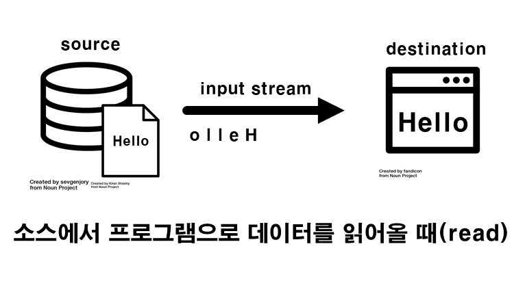
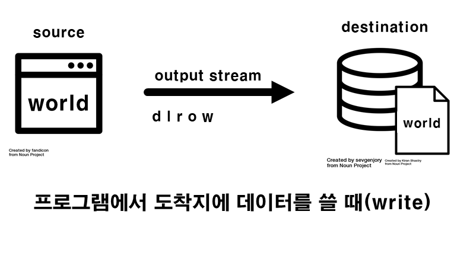
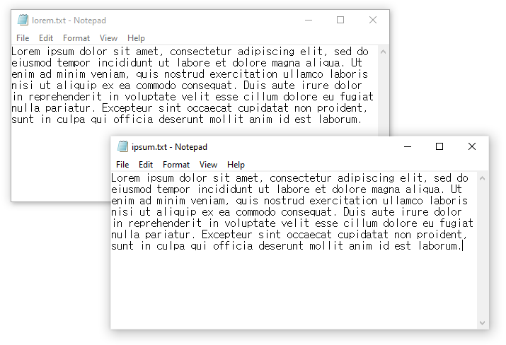
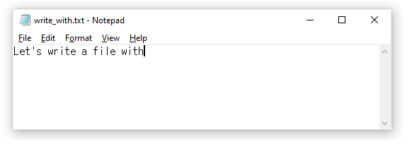
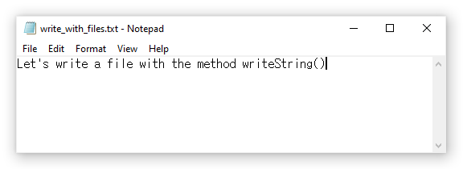
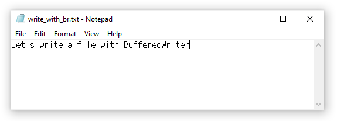
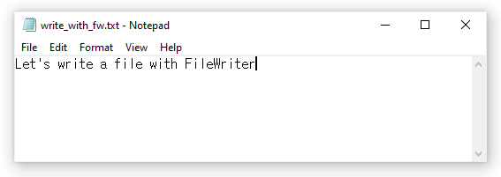
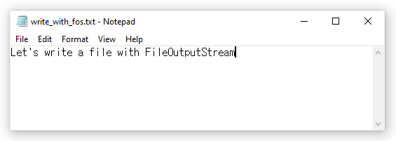

# [자바 라이브 스터디] 13주차 - I/O

> I/O(Input/Output, 입출력) : 컴퓨터 내부 또는 외부의 장치와 프로그램간의 데이터를 주고받는 것을 말한다.

#### 목표

```
자바의 Input과 Output에 대해 학습하세요.
```

#### 학습할 것

`🟢 completed` `🟡 in progress` `⚪ not done`

- 🟢 스트림 (Stream) / 버퍼 (Buffer) / 채널 (Channel) 기반의 I/O
- 🟢 InputStream과 OutputStream
- 🟢                  Byte와 Character 스트림
- 🟢 표준 스트림 (System.in, System.out, System.err)
- 🟢 파일 읽고 쓰기

---

## 자바 표준 I/O vs. New I/O

### Standard I/O

자바 프로그래밍에서 I/O 클래스는 스트림을 사용해 수행되었다. 모든 입출력은 스트림이라는 개채를 통해 한번에 하나씩 단일 바이트의 이동으로 표시된다. 스트림 입출력은 외부세계와의 연결에 사용된다. 내부적으로는 객체를 바이트로 변환하고 그것을 다시 객체로 변환하는 데에 사용되는데 이것을 직렬화와 역직렬화라고 한다.

#### 스트림

자바에서 입출력을 수행할 때 두 대상을 연결하고 데이터를 전달할 수 있게 해주는 통로역할을 하는 것이 스트림이다. 스트림은 한쪽 방향으로만 흐른다. 즉 단방향 통신만 가능하다는 뜻이다. 그래서 입출력을 동시에 처리하려면 입력스트림과 출력 스트림이 각각 필요하다. 

input stream은 소스에서 데이터를 읽을때 사용하고 output stream은 목적지에 데이터를 쓸때 사용한다. 스트림은 프리미티브 값과 오브젝트 등 모든 종류의 데이터를 처리할 수 있다. 





스트림은 한번에 하나의 데이터만 처리할 수 있고 중간에 건너뜀 없이 연속적으로 데이터를 주고받는다. 

데이터의 소스나 목적지는 데이터를 사용하거나 생성하는 어떤 것이라도 될 수 있다. 즉 데이터를 입출력할 소스나 목적지가 디스크 파일 뿐만 아니라 다른 프로그램이나 네트워크 소켓, 또는 배열이 될 수도 있다는 뜻이다.

### New I/O

자바의 NIO는 개인이 커스텀한 네이티브 코드를 작성하지 않고도 고속의 입출력 작업을 구현할 수 있도록 하기 위해 만들어졌다. NIO는 시간에 가장 많이 걸리는 입출력 작업(즉 배퍼를 주입하고 배출하는 작업)을 운영체제 안으로 다시 이동시키기 때문에 속도가 크게 향상된다. 

NIO에서는 클래스가 데이터를 보관하고 그 데이터를 블록 단위로 처리하게 하는 방식을 사용했기 때문에 네이티브 코드 없이도 기존의 `java.io` 패키지에서 할수 없었던 저수준의 최적화를 이용할 수 있는 것이다.

#### 버퍼

버퍼 클래스는 `java.nio`가 만들어지는 데 있어서 가장 중요한 기반이다.

- 버퍼는 고정된 양의 데이터를 위한 컨테이너라고 할 수 있다. 버퍼는 데이터를 저장하고 나중에 찾아올 수 있는 임시 준비 영역 또는 홀딩 탱크의 역할을 한다.
- 버퍼는 채널과 연동된다. 채널은 I/O 전송이 수행되는 실질적인 포털이고 버퍼는 그 데이터 전송의 소스 또는 대상이 된다.
- 외부 전송의 경우 우리가 보내려는 데이터를 버퍼에 위치시키면 버퍼가 아웃 채널에 전달된다.
- 내부 전송의 경우 채널은 우리가 제공하는 버퍼 안에 데이터를 저장한다. 그러면 데이터가 버퍼에서 인 채널로 복사된다.
- NIO API에서 데이터를 효율적으로 처리하는 핵심이 바로 이런 상호협력하는 객체 사이에서의 버퍼의 이동이다.

#### 채널

<!-- 전체적으로 무슨말인지 모르겠다. -->
채널은 `java.nio`에서 버퍼 다음으로 중요하다. 채널은 바이트 버퍼와 반대편 끝의 엔티티(일반적으로 파일이나 소켓) 사이에 데이터를 효율적으로 전송해주는 매체로 I/O 서비스에 직접 연결된다.

일반적으로 채널은 운영체제의 [파일 디스크립터](https://en.wikipedia.org/wiki/File_descriptor)와 일대일 관계를 가진다. 채널 클래스는 플랫폼 독립성을 유지하는 데 필요한 추상화를 제공하면서도 최신 운영 체제의 기본 I/O 기능을 모델링한다.

채널은 운영 체제의 기본 I/O 서비스에 최소한의 오버헤드로 액세스할 수 있는 게이트웨이이며, 버퍼는 채널이 데이터를 송수신하는 데 사용하는 내부 종점이다.

---

## InputStream과 OutputStream

바이트단위로 데이터를 전송하는 스트림은 `InputStream`과 `OutputStream`이 있다. 어떤 대상에 대해 입력과 출력 중 어떤 작업을 할 것인지에 따라 해당 스트림을 선택해서 사용하면 된다. 

| 입력스트림 | 출력 스트림 | 입출력 대상 종류 |
|---|---|---|
| FileInputStream | FileOutputStream | 파일 |
| ByteArrayInputStream | ByteArrayOutputStream | 메모리(byte배열) |
| PipedInputStream | PipedOutputStream | 프로세스(프로세스간의 통신) |
| AudioInputStream | AudioOutputStream | 오디오장치 |

### InputStream 주요 메서드

| 메서드명 | 설명 |
| --- | --- |
| abstract int read() | 1 byte를 읽어온다. 더 이상 읽을 데이터가 없으면 -1을 반환한다. |
| int read(byte[] b) | 배열 b의 크기만큼 읽어서 배열을 채우고 읽어온 데이터의 수를 반환한다. 반환하는 값은 항상 배열의 크기보다 작거나 같다. |
| int available() | 스트림에서 읽어올 수 있는 데이터의 크기를 반환한다. |
| void close() | 스트림을 닫아 사용하던 자원을 반환한다. |

### OutputStream 주요 메서드

| 메서드명 | 설명 |
| --- | --- |
| abstract int write(int b) | 주어진 값을 출력소스에 쓴다. |
| int write(byte[] b) | 주어진 배열 b에 저장된 내용을 출력소스에 쓴다. |
| void flush() | 스트림 버퍼에 있는 모든 내용을 출력소스에 쓴다. |
| void close() | 입력소스를 닫아 사용하던 자원을 반환한다. |

---

## Byte와 Character 스트림

### Byte Streams

자바는 1 byte 단위로 입출력을 수행하기 위해 바이트 스트림을 사용한다. 모든 바이트 스트림 클래스는 `InputStream`과 `OutputStream`의 하위 클래스이다. 

#### 바이트 스트림 사용하기

파일 입출력 바이트 스트림인 `FileInputStream`과 `FileOutputStream`을 사용해서 `lorem.txt` 파일을 읽어들여서 파일 내용을 `ipsum.txt`로 복사하는 프로그램을 만들어서 바이트 스트림이 어떻게 동작하는지 살펴보았다. 다른 바이트 스트림도 구성된 방식에서 차이가 있어도 사용되는 방식은 거의 동일하다.

```java
import java.io.FileInputStream;
import java.io.FileOutputStream;
import java.io.IOException;

public class CopyBytes {
    public static void main(String[] args) throws IOException {

        FileInputStream in = null;
        FileOutputStream out = null;

        try {
            in = new FileInputStream("lorem.txt");
            out = new FileOutputStream("ipsum.txt");
            int c;

            while ((c = in.read()) != -1) {
                out.write(c);
            }
        } finally {
            if (in != null) {
                in.close();
            }
            if (out != null) {
                out.close();
            }
        }
    }
}
```

> 결과



#### 스트림은 항상 닫아준다

더 이상 사용하지 않는 스트림을 닫아주는 것은 굉장히 중요하다. 혹시 에러가 발생하더라도 스트림이 반드시 닫힐 수 있도록 finally block을 사용히면 심각한 리소스 누수를 피할 수 있다.

#### 바이트 스트림을 사용해선 안되는 경우

CopyBytes 프로그램은 일반적으로는 사용해선 안되는 저수준의 I/O를 보여준다. `lorem.txt`는 문자 데이터가 포함되어 있기 때문에 문자 스트림을 사용하는 것이 좋다. 더 복잡한 데이터타입을 위한 스트림도 있다. 바이트 스트림은 프리미티브 I/O에만 사용해야 한다.

### Character Streams

문자 스트림은 2 byte 단위로 입출력을 수행한다. 자바의 문자 스트림 입출력은 유니코드를 사용해서 문자 값을 저장한다. 따라서 문자 스트림으로 입출력을 수행할 때 로컬 캐릭터셋을 자동으로 국제화표준에 맞춰준다.

#### 문자 스트림 사용하기

문자 스트림을 사용하는 방법은 바이트 스트림을 사용하는 방식과 동일하다. InputStream을 Reader, OutputStream을 Writer로 바꿔주기만 하면 된다.

바이트 스트림과 문자 스트림은 둘다 입출력에 정수형 변수를 사용한다. 다만 바이트 스트림은 정수형 변수가 마지막 8 bit에 바이트 값을 저장하고, 문자스트림은 16 bit에 캐릭터 값을 저장한다는 점만 다르다.

<!-- 해야할 곳!!!!!!!!!!!!!! -->

### 보조스트림

보조스트림은 자체적으로 입출력을 수행할 수 없고 기반스트림의 기능을 보완해주는 역활을 한다. 따라서 스트림을 먼저 생성한 다음에 이를 이용해서 보조스트림을 생성해야 한다.

```java
FileInputStream in = new FileInputStream("test.txt");
BufferedInputStream bis = new BufferedInputStream(in);
bis.read();
```

위의 코드에서 실제 입력 기능은 `FileInputStream`이 수행하고 `BufferedInputStream`은 버퍼만 제공한다. 버퍼를 사용하면 입출력의 성능차이가 크게 나기 때문에 대부분의 경우 버퍼를 이용한 보조스트림을 사용한다.

#### 보조스트림의 종류

| 입력 | 출력 | 설명 |
| --- | --- | --- |
| FilterInputStrream | FilterOutputStream | 필터를 이용한 입출력 처리 |
| BufferedInputStrream | BufferedOutputStream | 버퍼를 이용한 입출력 성능향상 |
| DataInputStrream | DataOutputStream | 기본형으로 데이터를 처리하는 기능 |
| SequenceInputStrream | - | 두개의 스트림을 하나로 연결 |
| ObjectInputStrream | ObjectOutputStream | 데이터를 객체단위로 읽고 쓰는데 사용 |
| - | PrintOutputStream | 버퍼를 이용하고, 추가적인 print 관련 기능 |
| PushBackInputStrream | - | 버퍼를 이용해 읽어온 데이터를 다시 되돌리는 기능 |

---

<!-- 해야할 곳!!!!!!!!!!!!!! -->
## 표준 스트림 (System.in, System.out, System.err)

표준 입출력은 콘솔을 통해 데이터의 입출력을 수행한다. 

    System.in   콘솔에서 데이터를 입력받는데 사용
    System.out  콘솔에 데이터를 출력하는데 사용
    System.err  콘솔에 데이터를 출력하는데 사용

표준 스트림의 입출력 대상을 콘솔이 아닌 다른 대상으로 변경하는 것도 가능하다.

| 메서드 | 설명 |
|---|---|
| static void setOut(PrintStream out) | System.out의 출력을 지정된 PrintStream으로 변경 |
| static void setErr(PrintStream err) | System.err의 출력을 지정한 PrintStream으로 변경 | 
| static void setIn(PrintStream in) | System.in의 출력을 지정한 InputStream으로 변경 | 

---

## 파일 읽고 쓰기

### 파일 읽기

#### 1. BufferedReader로 콘솔 입력 읽기

```java
import java.io.BufferedReader;
import java.io.IOException;
import java.io.InputStreamReader;

public class ReadConsoleBR {
    public static void main(String[] args) {
        try (BufferedReader br = new BufferedReader(new InputStreamReader(System.in))){
            System.out.println("What is your name?");
            String name = br.readLine();
            System.out.println("Welcome, " + name + "!");
        } catch (IOException e){
            e.printStackTrace();
        }

    }
}
```

> 결과

```
What is your name?
John Doe
Welcome, John Doe!
```

#### 2. BufferedReader로 파일 읽기

```java
import java.io.BufferedReader;
import java.io.FileReader;
import java.io.IOException;

public class ReadFileBR {
    public static void main(String[] args) {
        try (BufferedReader br = new BufferedReader(new FileReader("C:/.../java-io.txt"))){
            String line;
            while((line = br.readLine()) != null){
                System.out.println(line);
            }
        } catch (IOException e) {
            e.printStackTrace();
        }
    }
}
```

> 결과

```
Lesson: Basic I/O

This lesson covers the Java platform classes used for basic I/O. It first focuses on I/O Streams, a powerful concept that greatly simplifies I/O operations. The lesson also looks at serialization, which lets a program write whole objects out to streams and read them back again. Then the lesson looks at file I/O and file system operations, including random access files.

Most of the classes covered in the I/O Streams section are in the java.io package. Most of the classes covered in the File I/O section are in the java.nio.file package.
```

#### 3. NIO로 파일 읽기

```java
import java.io.IOException;
import java.nio.file.Files;
import java.nio.file.Path;
import java.nio.file.Paths;
import java.util.stream.Stream;

public class ReadFileNIO {
    public static void main(String[] args) {
        Path path = Paths.get("C:/.../java-io.txt");

        try (Stream<String> lines = Files.lines(path)){
            lines.forEach(s -> System.out.println(s));
        } catch (IOException e) {
            e.printStackTrace();
        }
    }
}
```

> 결과

```java
// 위와 동일
```

### 파일 쓰기

> 공통파일



#### 1. Files.writeString() - Java 11

```java
public class WriteFileFiles {
    public static void main(String[] args) throws IOException {
        String path = "C:/.../write_with";
        Path f = Path.of(path + ".txt");
        String content = Files.readString(f) + " the method writeString()";

        String to = path + "_files.txt";
        Files.writeString(Path.of(to), content);
    }
}
```

> 결과



#### 2. BufferedWriter로 파일 쓰기

```java
public class WriteFileBufferedWriter {
    public static void main(String[] args) throws IOException {
        String path = "C:/.../write_with";
        Path f = Path.of(path + ".txt");
        String content = Files.readString(f) + " BufferedWriter";

        BufferedWriter writer = new BufferedWriter(new FileWriter(path + "_br.txt"));
        writer.write(content);
        writer.close();
    }
}
```

> 결과



#### 3. FileWriter로 파일 쓰기

```java
public class WriteFileFileWriter {
    public static void main(String[] args) throws IOException {
        String path = "C:/.../write_with";
        Path f = Path.of(path + ".txt");
        String content = Files.readString(f) + " FileWriter";

        FileWriter fw = new FileWriter(path + "_fw.txt");
        fw.write(content);
        fw.close();
    }
}
```

> 결과



#### 4. FileOutputStream로 파일 쓰기

```java
public class WriteFileFOS {
    public static void main(String[] args) throws IOException {
        String path = "C:/.../write_with";
        Path f = Path.of(path + ".txt");
        String content = Files.readString(f) + " FileOutputStream";

        FileOutputStream fos = new FileOutputStream(path + "_fos.txt");
        byte[] strToBytes = content.getBytes();
        fos.write(strToBytes);
        fos.close();
    }
}
```

> 결과



---


## 참고자료

1. 남궁성. *Java의 정석 3판.* 도우출판, 2016.

2. Evans, Benjamin J. and David Flanagan. *Java in a Nutshell.* O'Reilly Media, 2019.

3. https://docs.oracle.com/javase/tutorial/essential/io/index.html

4. https://howtodoinjava.com/java-io-tutorial/

5. https://www.tcpschool.com/java/java_io_stream

6. https://www.baeldung.com/java-io
