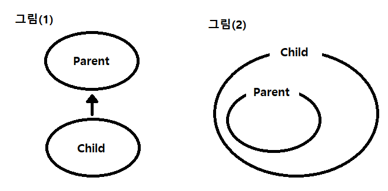
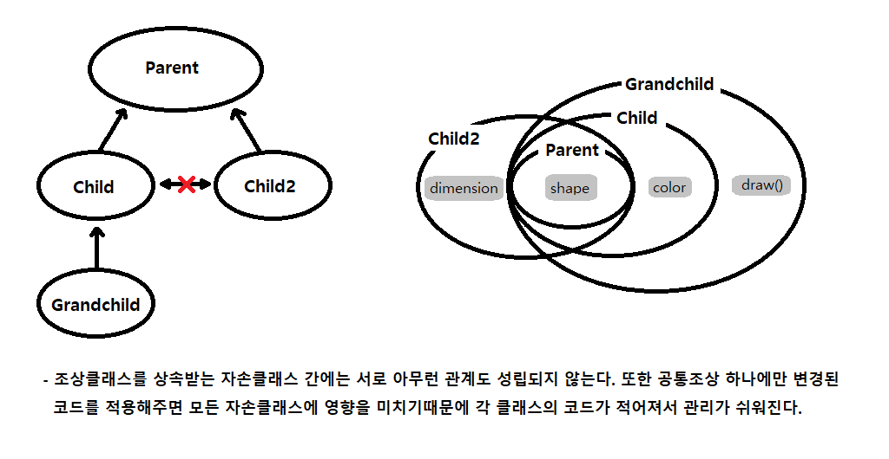

# 자바 라이브 스터디 6주차

#### 목표

```
자바의 상속에 대해 학습하세요.
```

#### 학습할 것

`🟢 completed` `🟡 in progress` `⚪ not done`

- 🟡 자바 상속의 특징
- ⚪ super 키워드
- ⚪ 메소드 오버라이딩
- ⚪ 다이나믹 메소드 디스패치 (Dynamic Method Dispatch)
- ⚪ *(Optional)* java double dispatch 
- ⚪ 추상 클래스
- ⚪ final 키워드
- ⚪ Object 클래스

---

## 자바 상속의 특징

### 상속이란

상속이란 기존의 클래스를 재사용해 새로운 클래스를 작성하는 것이다. 상속을 사용하면 적은 양의 코드로 새로운 클래스를 작성할 수 있고 코드를 공통적으로 관리할 수 있기 때문에 코드 추가 및 변경이 용이하다. 이런 특징은 코드의 재사용성을 높이고 코드의 중복을 제거해 프로그램의 생산성과 유지보수에 좋다.

### 구현방법

```java
class Parent{
  //
}

class Child extends Parent{
  // 
}
```

위와 같은 두 클래스를 서로 상속관계에 있다고 하고, 상속해주는 클래스를 '조상 클래스'라고 하고 상속 받는 클래스는 '자손 클래스'라고 한다.

```
조상클래스 = 부모(parent)클래스 = 상위(super)클래스, 기반(base)클래스
자손클래스 = 자식(child)클래스 = 하위(sub)클래스, 파생된(derived)클래스
```

#### 상속계층도

아래 그림(1)은 클래스 간의 상속관계를 그림으로 그린 상속계층도(class hierarchy)이다. 자손 클래스는 조상 클래스의 모든 멤버를 상속받고 클래스는 멤버들의 집합이므로 그림(2)와 같이 표현할 수도 있다.



`Child` 클래스를 상속받는 `Grandchild` 클래스를 추가하면 `Child` 클래스는 `Grandchild` 클래스의 직접조상이 된다. `Parent` 클래스는 `Grandchild` 클래스의 간접조상이 되고 둘은 간접적인 상속관계에 있게 된다. `Parent` 클래스에 추가된 멈버변수 `shape`은 `Parent` 클래스의 모든 자손에 추가되고, 삭제하는 경우에도 마찬가지이다.



조상클래스가 변경되면 자손클래스는 자동적으로 영향을 받지만, 자손클래스가 변경되도 조상클래스에는 아무 영향을 주지 못한다. 조상클래스를 상속받는 자손클래스가 여러개라면 자손클래스 간에는 서로 아무런 관계도 성립되지 않는다. 하나의 조상클래스를 상속받은 모든 자손클래스에 공통적인 추가 또는 변경사항이 있다면 각각의 클래스에서 할 필요 없이 공통조상 하나에만 적용해주면 되기 때문에 코드 작성이 간단해지고 코드 중복이 줄어들어 유지보수가 쉽고 일관성을 유지하기 쉽다. 

---

## super 키워드

---

## 메소드 오버라이딩

---

## 다이나믹 메소드 디스패치

---

## 자바 더블 디스패치

---

## 추상 클래스

---

## final 키워드

---

## Object 클래스

---

## 참고자료

1. 남궁성. *Java의 정석 3판.* 도우출판, 2016.

2. Evans, Benjamin J. and David Flanagan. *Java in a Nutshell.* O'Reilly Media, 2019.

3. https://howtodoinjava.com/java/oops/object-oriented-programming/

4. https://docs.oracle.com/javase/tutorial/java/javaOO/index.html