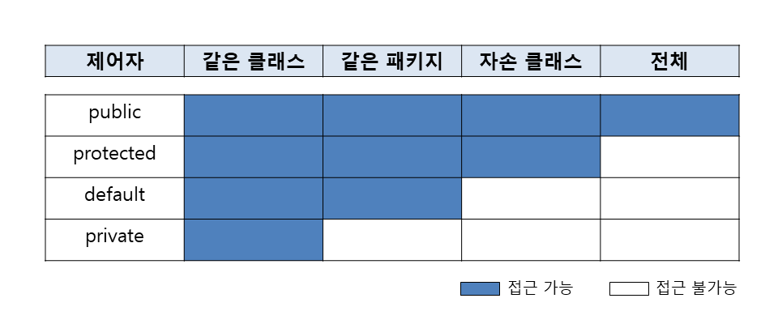

# 자바 라이브 스터디 6주차

#### 목표

```
자바의 패키지에 대해 학습하세요.
```

#### 학습할 것

`🟢 completed` `🟡 in progress` `⚪ not done`

- 🟢 package
- ⚪ import
- ⚪ 클래스패스
- ⚪ CLASSPATH 환경변수
- ⚪ -classpath 옵션
- ⚪ 접근지시자

---

## Package

패키지는 클래스의 묶음이다. 패키지에는 클래스 또는 인터페이스를 포함할 수 있고 서로 관련된 클래스들끼리 그룹 단위로 묶어서 클래스를 효율적으로 관리할 수 있다. 서로 다른 패키지 안에 같은 이름의 클래스가 존재할 수 있다. 클래스의 전체이름(full name)은 패키지명을 포함한다. 그렇기 때문에 클래스 이름이 같더라도 패키지명으로 구별이 가능하다. 

클래스가 물리적으로 하나의 클래스파일(.class)인 것과 같이 **패키지는 물리적으로 하나의 디렉토리**이다. 디렉토리가 하위 디렉토리를 갖듯이, 패키지도 다른 패키지를 포함할 수 있고 점 `.`으로 구분한다.

예를 들어 String 클래스의 full name은 java.lang.String이다. 즉, java.lang 패키지에 속한 String 클래스라는 의미이다. 물리적으로는 디렉토리 java의 서브 디렉토리 lang에 속한 String.class 파일이다. 


Date 클래스는 동일 클래스 이름으로 java.util 패키지에 속한 Date 클래스, java.sql에 속한 Date 클래스 두 개가 있는 것이 보이고 패키지명으로 구별할 수 있다.


```
- 하나의 소스파일에는 첫 줄에 단 한 번의 패키지 선언만을 허용한다.
- 모든 클래스는 반드시 하나의 패키지에 속해야 한다.
- 패키지는 점(.) 을 구분자로 하여 계층구조로 구성할 수 있다.
- 패키지는 물리적으로 클래스파일(.class)을 포함하는 하나의 디렉토리이다.
```

---

## package 선언

클래스나 인터페이스의 소스파일에 다음과 같이 패키지를 선언해준다:

```java
package 패키지명;
```

패키지 선언문은 주석과 공백을 제외하고 반드시 첫 줄에 와야하며 하나의 소스파일에 단 한번만 선언될 수 있다. 패키지명은 대소문자 모두 가능하지만 클래스명과 구분하기 쉽게 소문자로 하는 것이 원칙이다.

소스파일에 자신이 속할 패키지를 지정하지 않은 클래스는 자동적으로 `unnamed package`에 속하게 된다. 따라서 패키지를 지정하지 않는 모든 클래스들은 같은 패키지에 속하게 된다.

---

## import 문

다른 패키지의 클래스를 사용하고자 할 때 클래스 코드를 작성하기 전에 import문으로 사용하고자 하는 클래스의 패키지를 미리 명시해주면 소스코드에 사용되는 클래스 이름에서 패키지 명을 생략할 수 있다. 매번 패키지명이 포함된 클래스 이름을 사용해야 하는 번거로움을 덜어주는 것이ek.

만약 import문으로 패키지를 지정하지 않으면 아래와 같이 모든 클래스 이름 앞에 패키지명을 반드시 분여야 한다.

```java
java.util.Date today = new java.util.Date();
java.text.SimpleDateFormat date = new java.text.SimpleDateFormat("yyyy/MM/dd");
```

import문의 역할은 컴파일러에게 소스파일에 사용된 클래스의 패키지에 대한 정보를 제공하는 것이다. 컴파일 시 컴파일러는 import문을 통해 소스파일에 사용된 클래스들의 패키지를 알아 낸 다음, 모든 클래스 이름 앞에 패키지 명을 붙여준다.

---

## import 선언

모든 소스파일에서 import문은 package문 다음에, 클래스 선언문 이전에 위치해야 한다. import문은 한 소스파일에 여러 번 선언할 수 있다. 

```java
import 패키지명.클래스명;
// 또는
import 패키지명.*;
```

같은 패키지에서 여러 개의 클래스를 사용할 때는 `패키지명.*`을 이용해서 지정된 패키지에 속하는 모든 클래스를 사용할 수 있다. 주의할 점은 import문에서 클래스의 이름 대신 `*`을 사용하는 것이 하위 패키지의 클래스까지 포함하는 것은 아니라는 것이다.

```java
import java.util.*;
import java.text.*;

// 위의 두 문장을 아래와 같이 대신하지는 못한다.

import java.*;
```

### static import문

static import문을 사용하면 static 멤버를 호출할 때 클래스 이름을 생략할 수 있다. 특정 클래스의 static 멤버를 자주 사용할 때 편리하고 코드도 간결해진다.

```java
import static java.lang.Math.random;
import static java.lang.System.out;

public class StaticImport{
  public static void main(String[] args) {
    out.println(random());
  }
}
```

---

## 클래스패스


---

## CLASSPATH 환경변수

---

## -classpath 옵션

---

## 접근지시자

접근제어자(access modifier)는 멤버 또는 클래스에 사용되고 행당 멤버 또는 클래스를 외부에서 접근하지 못하도록 제한하는 역할을 한다. 전근제어자가 명시되어 있지 않다면 기본적으로 default로 지정된다.

```java
// 접근제어자가 사용될 수 있는 곳 - 클래스, 멤버변수, 메소드, 생성자

private     // 같은 클래스 내에서만 접근 가능
default     // 같은 패키지 내에서만 접근 가능
protected   // 같은 패키지 내에서, 다른 패키지의 자손클래스에서 접근 가능
public      // 접근 제한 없음
```

### 접근 범위 



`public`은 접근 제한이 전혀 없고 `private`은 같은 클래스 내에서만 사용하도록 제한하는 가장 높은 제한이다. `default`는 같은 패키지 내의 클래스에서만 접근이 가능하다. `protected`는 패키지에 관계없이 상속관계에 있는 자손클래스에서만 접근에 가능하다.

### 접근제어자 사용 가능 대상


### 접근제어자를 이용한 캡슐화

클래스의 내부에 선언된 데이터를 보호하기 위해서 접근제어자를 사용한다. 데이터가 유효한 값을 유지하게 하고 외부에서 함부로 변경하지 못하도록 하기 위해서 외부로부터의 접근을 제한하는 것이다. 이것을 **데이터 감추기(data hiding)** 라고 하고 객체지향개념의 **캡슐화(encapsulation)** 에 해당한다.

또 다른 이유로 클래스 내에서만 사용되는, 내부 자겁을 위해 임시로 사용되는 멤버변수나 부분작업을 처리하기 위한 메소드 등의 멤버들을 클래스 내부에 감추기 위해서 사용한다. 외부에서 접근할 필요가 없는 멤버들을 private으로 지정해 외부에 노출시키지 않아 복잡성을 줄일 수 있다.

#### 정리

접근제어자를 사용하는 이유

- 외부로부터 데이터를 보호하기 위해
- 외부에서 불필요한, 내부적으로만 사용되는 부분을 감추기 위해서

---

## 참고자료

1. 남궁성. *Java의 정석 3판.* 도우출판, 2016.

2. Evans, Benjamin J. and David Flanagan. *Java in a Nutshell.* O'Reilly Media, 2019.

3. https://howtodoinjava.com/java/basics/java-classpath/

4. https://docs.oracle.com/javase/tutorial/java/package/index.html

5. http://www.tcpschool.com/java/java_usingClass_package