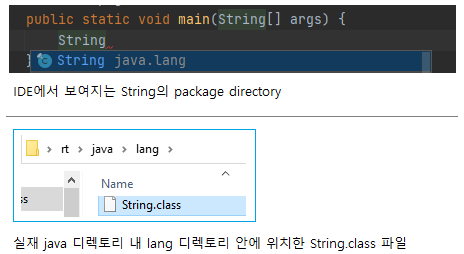
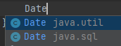
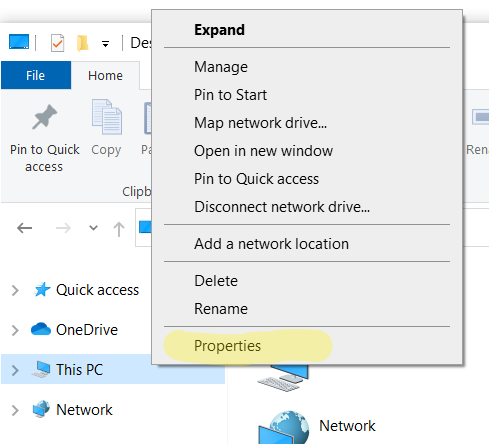
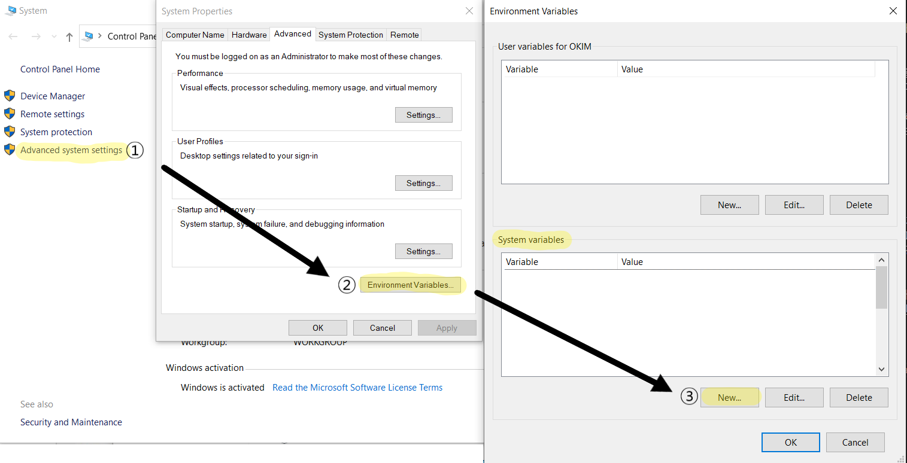
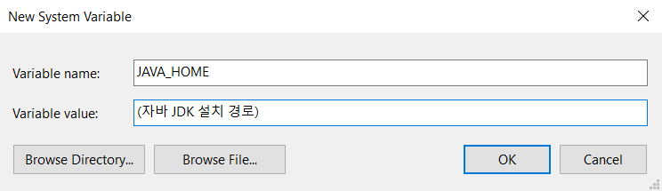
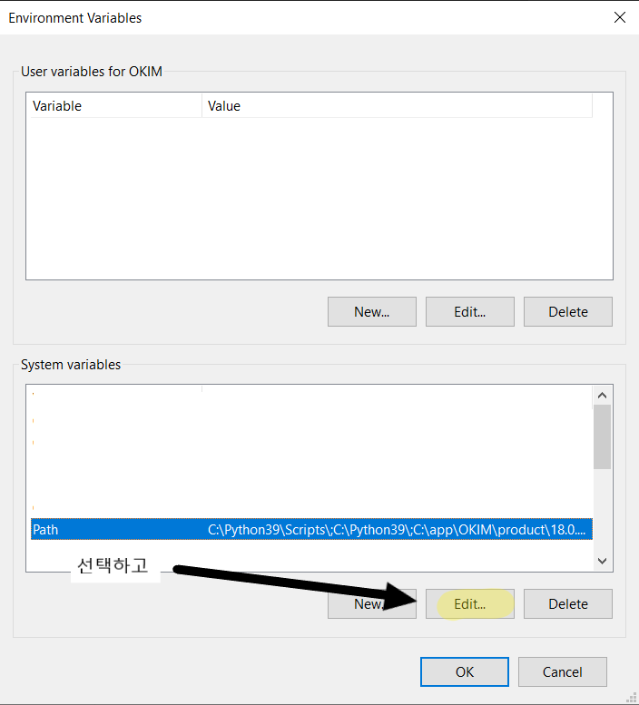
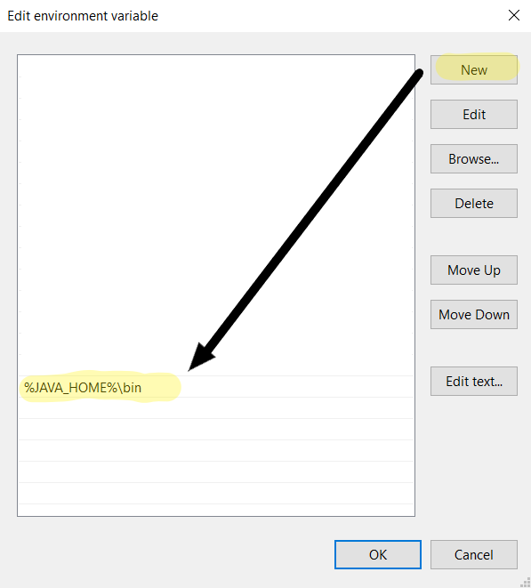
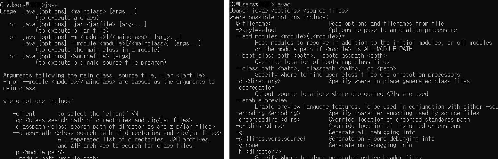

# 자바 라이브 스터디 7주차

#### 목표

```
자바의 패키지에 대해 학습하세요.
```

#### 학습할 것

`🟢 completed` `🟡 in progress` `⚪ not done`

- 🟢 package
- 🟢 import
- 🟢 클래스패스
- 🟢 CLASSPATH 환경변수
- 🟢 -classpath 옵션
- 🟢 접근지시자

---

## Package

패키지는 클래스의 묶음이다. 패키지에는 클래스 또는 인터페이스를 포함할 수 있고 서로 관련된 클래스들끼리 그룹 단위로 묶어서 클래스를 효율적으로 관리할 수 있다. 서로 다른 패키지 안에 같은 이름의 클래스가 존재할 수 있다. 클래스의 전체이름(full name)은 패키지명을 포함한다. 그렇기 때문에 클래스 이름이 같더라도 패키지명으로 구별이 가능하다. 

클래스가 물리적으로 하나의 클래스파일(.class)인 것과 같이 **패키지는 물리적으로 하나의 디렉토리**이다. 디렉토리가 하위 디렉토리를 갖듯이, 패키지도 다른 패키지를 포함할 수 있고 점 `.`으로 구분한다.

예를 들어 String 클래스의 full name은 java.lang.String이다. 즉, java.lang 패키지에 속한 String 클래스라는 의미이다. 물리적으로는 디렉토리 java의 서브 디렉토리 lang에 속한 String.class 파일이다. 



Date 클래스는 동일 클래스 이름으로 java.util 패키지에 속한 Date 클래스, java.sql에 속한 Date 클래스 두 개가 있는 것이 보이고 패키지명으로 구별할 수 있다.



### 정리

- 하나의 소스파일에는 첫 줄에 단 한 번의 패키지 선언만을 허용한다.
- 모든 클래스는 반드시 하나의 패키지에 속해야 한다.
- 패키지는 점(.) 을 구분자로 하여 계층구조로 구성할 수 있다.
- 패키지는 물리적으로 클래스파일(.class)을 포함하는 하나의 디렉토리이다.

---

## package 선언

클래스나 인터페이스의 소스파일에 다음과 같이 패키지를 선언해준다:

```java
package 패키지명;
```

패키지 선언문은 주석과 공백을 제외하고 반드시 첫 줄에 와야하며 하나의 소스파일에 단 한번만 선언될 수 있다. 패키지명은 대소문자 모두 가능하지만 클래스명과 구분하기 쉽게 소문자로 하는 것이 원칙이다.

소스파일에 자신이 속할 패키지를 지정하지 않은 클래스는 자동적으로 `unnamed package`에 속하게 된다. 따라서 패키지를 지정하지 않는 모든 클래스들은 같은 패키지에 속하게 된다.

---

## import 문

다른 패키지의 클래스를 사용하고자 할 때 클래스 코드를 작성하기 전에 import문으로 사용하고자 하는 클래스의 패키지를 미리 명시해주면 소스코드에 사용되는 클래스 이름에서 패키지 명을 생략할 수 있다. 매번 패키지명이 포함된 클래스 이름을 사용해야 하는 번거로움을 덜어주는 것이ek.

만약 import문으로 패키지를 지정하지 않으면 아래와 같이 모든 클래스 이름 앞에 패키지명을 반드시 분여야 한다.

```java
java.util.Date today = new java.util.Date();
java.text.SimpleDateFormat date = new java.text.SimpleDateFormat("yyyy/MM/dd");
```

import문의 역할은 컴파일러에게 소스파일에 사용된 클래스의 패키지에 대한 정보를 제공하는 것이다. 컴파일 시 컴파일러는 import문을 통해 소스파일에 사용된 클래스들의 패키지를 알아 낸 다음, 모든 클래스 이름 앞에 패키지 명을 붙여준다.

---

## import 선언

모든 소스파일에서 import문은 package문 다음에, 클래스 선언문 이전에 위치해야 한다. import문은 한 소스파일에 여러 번 선언할 수 있다. 

```java
import 패키지명.클래스명;
// 또는
import 패키지명.*;
```

같은 패키지에서 여러 개의 클래스를 사용할 때는 `패키지명.*`을 이용해서 지정된 패키지에 속하는 모든 클래스를 사용할 수 있다. 주의할 점은 import문에서 클래스의 이름 대신 `*`을 사용하는 것이 하위 패키지의 클래스까지 포함하는 것은 아니라는 것이다.

```java
import java.util.*;
import java.text.*;

// 위의 두 문장을 아래와 같이 대신하지는 못한다.

import java.*;
```

### static import문

static import문을 사용하면 static 멤버를 호출할 때 클래스 이름을 생략할 수 있다. 특정 클래스의 static 멤버를 자주 사용할 때 편리하고 코드도 간결해진다.

```java
import static java.lang.Math.random;
import static java.lang.System.out;

public class StaticImport{
  public static void main(String[] args) {
    out.println(random());
  }
}
```

---

## 클래스패스

클래스패스는 자바 프로그램을 실행시에 JVM이 클래스와 패키지를 어디서 찾아야 하는지 알려준다.

- 클래스패스의 기본값은 `.`이고, 현재 디렉토리를 뜻힌다.
- CLASSPATH 환경변수를 지정해주거나 커맨드라인에서  `-cp` 키워드를 사용해서 기본값을 덮어쓸 수 있다.
- 클래스패스를 여러개 지정해줄 때는 순서가 중요하다. java 인터프리터는 클래스패스 변수에 지정해준 디렉토리 순서대로 클래스를 찾는다.
- 클래스패스를 여러개 지정할 때 구분자를 사용한다. Windows에서는 `;`이고 Linux/Unix에서는 `:`를 사용한다.

---

## CLASSPATH 환경변수

런타임시에 항상 필요한 jar 파일의 위치를 정해줄거라면 컴퓨터의 `CLASSPATH` 환경변수를 지정해주는 것이 좋다. 그렇게 하면 런타임동안 어플리케이션 클래스 로더가 항상 그 변수 내의 지정된 경로에서 jar 파일과 클래스를 검색하게 다.

`CLASSPATH` 환경변수를 지정해주려면 컴퓨터의 사용자 환경변수에서 jar 파일들이 저장되어 있는 모든 경로를 추가해주면 된다. 여러개의 폴더, jar 파일, 클래스 사이는 구분자를 사용한다.

### 윈도우에서 설정하기

윈도우에서 사용자 환경변수는 아래의 순서에 따라 해준다.

1. `This PC > Properties` 또는 `제어판(Control Panel) > 시스템 및 보안(Systems and Security) > 시스템(System)`

    

2. 왼쪽 목록에서 `고급 시스템 설정(Advanced system settings) > 환경 변수(Environment Variables)`의 시스템 변수(System Variables) 섹션에서 `New` 클릭

    

3. 변수 이름은 `JAVA_HOME`으로, 변수 값은 자바 jdk가 설치되어 있는 폴더로 지정해준다.

    

4. 시스템 변수의 `Path` 선택 후 `편집(Edit)` 클릭

    

5. `새로 만들기(New)` 클릭 후 `%JAVA_HOME%\bin` 입력

    

6. 전부 저장해주고 cmd창에서 `javac`, `java` 명령어가 잘 되는지 확인

    

시스템 변수에서 새로 만들기 하지 않고 Path에서 바로 `jdk설치된폴더\bin`을 추가해줘도 상관은 없다.

### DOS Prompt에 임시로 클래스패스 설정하기

cmd창에서 클래스패스를 임시로 설정해주고 싶다면 `set CLASSPATH` 명령어를 사용하면 된다. 디렉토리나 아카이브(`.zip` 또는 `.jar` 파일), 또는 `*`가 아닌 클래스패스 항목은 무시된다.

```PowerShell
set CLASSPATH=.;C:\(자바 jdk가 설치된 폴더)\lib;
```

이렇게 설정한 클래스패스 변수는 지속되지 않는다. 즉, 현재 사용하고 있는 cmd창에서만 사용가능하고 다른 cmd창에서는 사용할 수 없다.

`dependency`라는 폴더에 사용하고자 하는 jar 파일이나 클래스파일이 있다고 가정해보자.

1. 클래스패스에 jar 파일 하나 추가하기

    ```PowerShell
    # windows
    set CLASSPATH=.;C:\dependency\myapp.jar

    # Linux/unix
    set CLASSPATH=.:/dependency/myapp.jar
    ```

2. 클래스패스에 jar 파일 여러개 추가하기

    두개 이상의 jar 파일을 추가하고 싶다면 사용하는 os에 맞는 구분자를 써서 나열해준다. 디렉토리에 있는 모든 jar 파일을 추가하고 싶다면 와일드카드 문자 `*`를 사용해주면 된다.

    ```PowerShell
    # windows use ;
    set CLASSPATH=.;C:\dependency\myapp.jar;C:\location\yourapp.jar

    # Linux/Unix use :
    set CLASSPATH=.:/dependency/myapp.jar:/location/*.jar
    ```

3. 클래스패스에 class 추가하기

    class를 추가하고 싶으면 그냥 class 파일이 있는 폴더를 추가해준다.

    ```PowerShell
    # windows
    set CLASSPATH=C:\dependency;C:\location

    # Linux/Unix
    set CLASSPATH=/dependency:/location
    ```

5. 클래스패스 설정 해제하기

    CLASSPATH 환경변수가 잘못 설정된 경우에는 빈 값을 지정해서 클래스패스 설정을 해제할 수 있다.

    ```PowerShell
    set CLASSPATH=
    ```

---

## -classpath 옵션

cmd/console에서 클래스패스를 설정하려면 `-classpath` 또는 `-cp`를 사용하면 된다.

```PowerShell
java -cp .;c:\jars myapp.jar
```

일반적으로 클래스패스에는 두 종류(클래스와 jar 파일)의 리소스를 포함시킨다.
- class를 추가하고 싶다면, class가 있는 폴더의 전체경로를 지정해준다.
- jar 파일을 추가하고 싶다면, jar 파일이 있는 폴더의 전체경로를 쓰고 끝에 `*`를 붙여준다.

    ```PowerShell
    -cp c:\dependency     # c:/dependency 에 있는 모든 클래스 포함
    -cp c:\dependency\*   # c:/dependency 에 있는 모든 jar 파일 포함
    -cp c:\dependency;c:dependency\*  # 모든 클래스 및 jar 파일 포함
    ```

> classpath에서 지정해준 디렉토리의 하위 디렉토리는 포함되지 않는다. `-cp c:/dependency/*`를 해준다고 dependency 디렉토리의 하위 디렉토리에 있는 파일들이 포함되는 것은 아니라는 의미이다.

---

## 지정된 `CLASSPATH` 값 확인

언제든지 `CLASSPATH` 변수로 지정된 모든 경로 항목을 보고 싶다면 `echo` 명령어를 시용한다.

```PowerShell
# Windows
echo %CLASSPATH%

# Linux/Unix
echo $CLASSPATH
```

만약 클래스패스가 지정되어 있지 않다면 리눅스에서는 `CLASSPATH: Undefined variable error` 에러메세지를 보여주고 Windows에서는 그냥 `%CLASSPATH%`를 보여준다.

## 접근지시자

접근제어자(access modifier)는 멤버 또는 클래스에 사용되고 행당 멤버 또는 클래스를 외부에서 접근하지 못하도록 제한하는 역할을 한다. 전근제어자가 명시되어 있지 않다면 기본적으로 default로 지정된다.

```java
// 접근제어자가 사용될 수 있는 곳 - 클래스, 멤버변수, 메소드, 생성자

private     // 같은 클래스 내에서만 접근 가능
default     // 같은 패키지 내에서만 접근 가능
protected   // 같은 패키지 내에서, 다른 패키지의 자손클래스에서 접근 가능
public      // 접근 제한 없음
```

### 접근 범위 


`public`은 접근 제한이 전혀 없고 `private`은 같은 클래스 내에서만 사용하도록 제한하는 가장 높은 제한이다. `default`는 같은 패키지 내의 클래스에서만 접근이 가능하다. `protected`는 패키지에 관계없이 상속관계에 있는 자손클래스에서만 접근에 가능하다.

### 접근제어자 사용 가능 대상


### 접근제어자를 이용한 캡슐화

클래스의 내부에 선언된 데이터를 보호하기 위해서 접근제어자를 사용한다. 데이터가 유효한 값을 유지하게 하고 외부에서 함부로 변경하지 못하도록 하기 위해서 외부로부터의 접근을 제한하는 것이다. 이것을 **데이터 감추기(data hiding)** 라고 하고 객체지향개념의 **캡슐화(encapsulation)** 에 해당한다.

또 다른 이유로 클래스 내에서만 사용되는, 내부 자겁을 위해 임시로 사용되는 멤버변수나 부분작업을 처리하기 위한 메소드 등의 멤버들을 클래스 내부에 감추기 위해서 사용한다. 외부에서 접근할 필요가 없는 멤버들을 private으로 지정해 외부에 노출시키지 않아 복잡성을 줄일 수 있다.

#### 정리

접근제어자를 사용하는 이유

- 외부로부터 데이터를 보호하기 위해
- 외부에서 불필요한, 내부적으로만 사용되는 부분을 감추기 위해서

---

## 참고자료

1. 남궁성. *Java의 정석 3판.* 도우출판, 2016.

2. Evans, Benjamin J. and David Flanagan. *Java in a Nutshell.* O'Reilly Media, 2019.

3. https://howtodoinjava.com/java/basics/java-classpath/

4. https://docs.oracle.com/javase/tutorial/java/package/index.html

5. https://docs.oracle.com/javase/specs/jls/se15/html/index.html

6. http://www.tcpschool.com/java/java_usingClass_package
